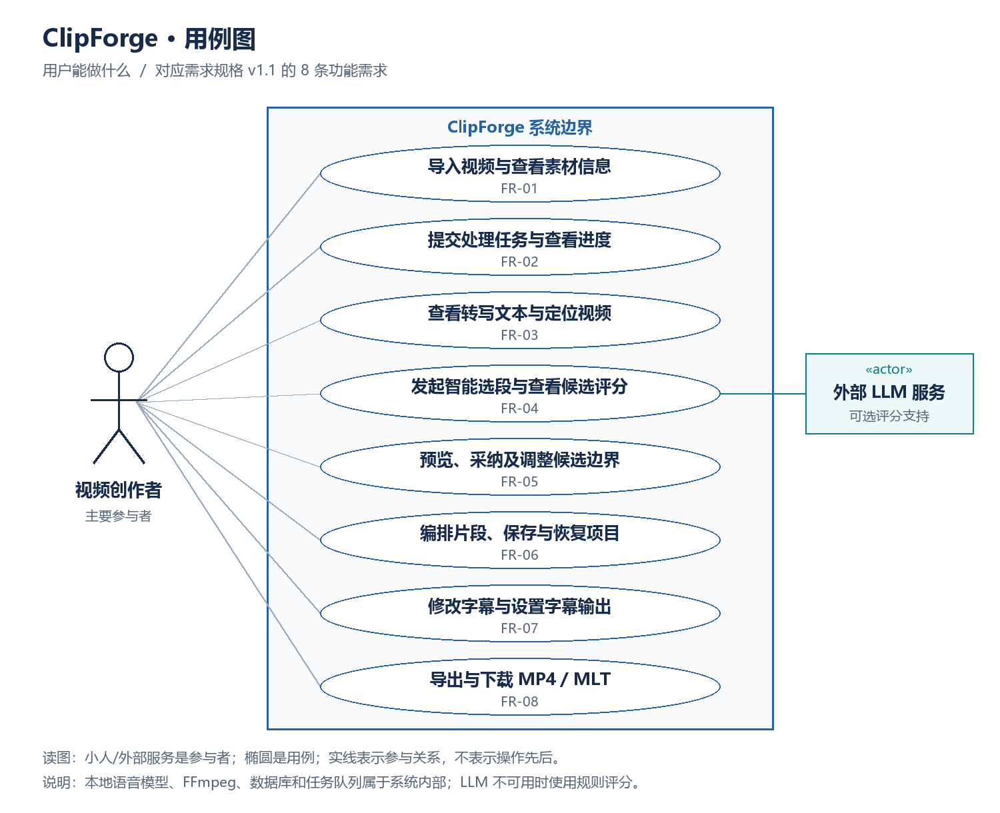
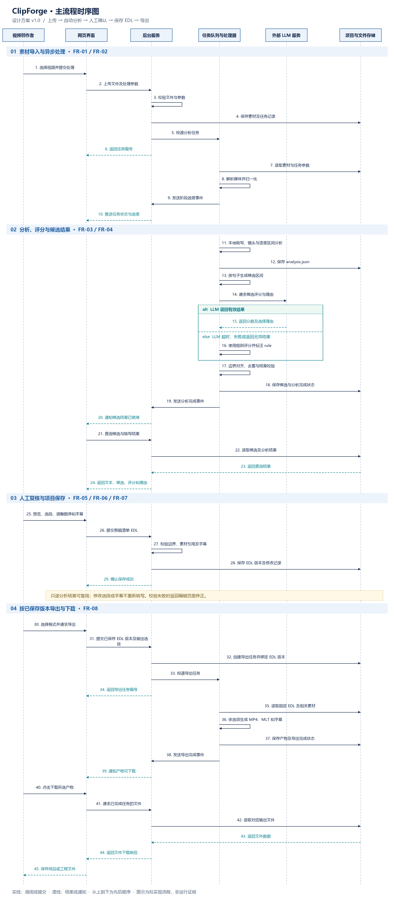

# ClipForge 用例图与主流程时序图

版本：v1.0  
日期：2026-09-17  
需求依据：[ClipForge 需求规格说明书 v1.1](requirements.md)  
状态：第一周设计交付，图中内容为拟实现方案，不表示功能已经开发或验收完成。

## 1. 设计范围

ClipForge 的主要使用者为视频创作者。用户导入素材后，系统利用现成的媒体处理工具、语音识别模型和评分能力生成候选，再由用户复核、修改和保存，最终导出 MP4 成品或可供 Shotcut 继续编辑的 MLT 工程。

两张图分别说明“用户能做什么”和“系统各部分怎样配合”。编号 FR-01 至 FR-08 与需求规格保持一致；非功能需求通过流程设计及后续测试落实，不绘制成独立的用户功能。

## 2. 用例图



图 1：ClipForge 的主要参与者、系统边界与功能用例。

### 2.1 怎样读这张图

- 左侧小人是主要参与者“视频创作者”。
- 蓝色方框是 ClipForge 系统边界，椭圆是用户可以使用的功能。
- 右侧的外部 LLM 服务是可选的辅助参与者，在启用 LLM 评分时参与候选评价。
- 实线表示参与关系，不表示时间先后、数据流或“点击这个功能才能进入下一个功能”。
- 本地语音模型、FFmpeg、数据库和任务队列是系统内部实现，不作为外部参与者。
- Shotcut 用于下载 MLT 后的外部精修。本版不设计 ClipForge 与 Shotcut 的在线接口，因此不把它画成直接参与者。

### 2.2 用例与需求对应

| 编号 | 用户目标 | 包含的主要行为 | 借鉴来源 |
| --- | --- | --- | --- |
| FR-01 | 导入视频与查看素材信息 | 本地上传、检查时长和分辨率等信息 | OpusClip、Descript、AutoClip、OpenCut 的导入体验；媒体准备方式依据任务书 |
| FR-02 | 提交处理任务与查看进度 | 发起处理、查看阶段、查看失败说明及适用的重试入口 | AutoClip 的后台流程、OpusClip 的处理提示 |
| FR-03 | 查看转写文本与定位视频 | 阅读转写文本，点击句子跳转到对应时间 | OpusClip、Descript 的文本与视频配合；点句定位为本项目设计目标 |
| FR-04 | 发起智能选段与查看候选评分 | 生成候选，查看时间、分数、理由和评分方式 | OpusClip 的候选评价、AutoClip 的自动分析与切片 |
| FR-05 | 预览、采纳及调整候选边界 | 预览、采纳、排除、调整起止时间 | OpusClip 的人工编辑流程、OpenCut 的片段编辑 |
| FR-06 | 编排片段、保存与恢复项目 | 排序、保存剪辑清单、重新打开继续编辑 | OpenCut、OpusClip 的保存恢复，以及 Shotcut 工程保存 |
| FR-07 | 修改字幕与设置字幕输出 | 修改文字，选择字幕文件或烧录输出 | OpusClip 的字幕修改体验；Descript 的字幕调整作为交互参考 |
| FR-08 | 导出与下载 MP4 / MLT | 选择画幅和格式，单个或批量输出，下载文件 | 已有产品输出流程与 Shotcut/MLT 工程互操作 |

FR-03 的镜头、语音活动和语音识别分析是支撑用户目标的内部处理；FR-07 的字幕文件在导出阶段生成。为保持图的可读性，子功能合并到对应椭圆，详细验收仍以需求规格为准。

## 3. 主流程时序图



图 2：素材上传、自动分析、人工确认、保存剪辑清单以及输出文件的主要交互。图片较长，可打开原图放大查看。

### 3.1 参与部分

| 图中名称 | 负责什么 |
| --- | --- |
| 视频创作者 | 提交素材、判断候选、修改内容和下载文件 |
| 网页界面 | 接收用户操作，展示文本、候选和任务状态 |
| 后台服务 | 校验请求、管理项目与任务、查询结果、保存编辑、提供下载 |
| 任务队列与处理器 | 安排耗时工作并执行媒体分析、评分和导出；图中将队列与执行进程合并表示 |
| 外部 LLM 服务 | 在启用模型评分时返回候选分数及理由；不负责直接生成剪辑文件 |
| 项目与文件存储 | 保存素材、任务状态、分析结果、候选、EDL 和输出文件；图中合并表示数据库与文件系统 |

图从上往下表示先后顺序。实线箭头表示调用或提交，虚线箭头表示结果或通知；为便于阅读，部分内部读取结果与写入确认已省略。alt/else 框表示两种互斥情况，一次执行按实际结果走其中一条。

### 3.2 四个阶段

**第一阶段：上传素材并启动后台任务。** 用户上传视频后，后台校验文件并保存任务记录，将耗时工作交给任务处理器，立即向网页返回任务编号。处理器完成媒体准备并报告进度，页面无需一直等待处理结束。

**第二阶段：分析并生成候选。** 处理器调用本地语音识别和检测组件，保存可复用的分析结果，随后组合候选。启用 LLM 时请求模型评分；有效结果用于后续处理，超时、失败或无效结果则触发规则评分。经过边界对齐和去重后保存候选，网页查询并展示结果。

**第三阶段：人工复核并保存。** 用户查看文本和候选，调整保留范围、顺序与字幕，再提交统一剪辑清单 EDL。后台校验通过后保存版本和修改记录，返回保存成功。候选评分只是建议，最终使用用户确认后的剪辑清单。

**第四阶段：按保存版本导出。** 用户选择格式与输出设置，后台创建绑定指定 EDL 版本的导出任务。处理器读取这个版本生成所选文件并保存结果，用户从完成状态的任务中下载。MP4、MLT 和字幕共享剪辑安排；MLT 的首版一致性范围为素材、片段顺序和切点，样式还原范围另行测试。

### 3.3 图中简化与异常处理

| 情况 | 设计处理 |
| --- | --- |
| 上传校验失败 | 返回可读提示，不投递有效分析任务。主图从校验成功继续。 |
| 直接选择规则评分 | 跳过外部 LLM 请求，直接执行规则评分；图中重点画出了 LLM 失败后的回退。 |
| LLM 超时或输出不符合格式 | 校验或超时由本地处理器判断，使用规则评分并标注 scorer 为 rule，不把模型故障等同于整个任务失败。 |
| 分析后没有可用候选 | 保存空结果及原因，页面说明情况，不能直接继续导出空的成片清单。 |
| 用户提交无效边界或素材引用 | 拒绝本次保存并返回具体错误，保留先前保存版本；修正并保存成功后再导出。 |
| 页面刷新或进度连接中断 | 根据任务编号重新查询持久化状态，恢复进度显示；进度通知用于及时反馈，数据库状态用于恢复。 |
| 渲染失败或进程中断 | 保存失败原因或按超时机制恢复状态，提供适用的重试入口；保留已保存 EDL。 |
| 导出期间继续编辑 | 当前导出任务使用绑定的版本；后续修改保存为新版本，需要重新发起导出才能反映到新产物中。 |
| 批量导出 | 对每个所选输出建立可追踪的结果记录，复用相同导出流程；主图以一次导出请求表示。 |

图中“发送阶段进度事件”概括后台处理器到服务端的通知机制，具体可经队列或消息通道转发；它不要求处理器直接调用网页。正式设计采用进度推送，起步实现可先通过状态查询跑通，后续补齐推送。图示不要求一次性实现所有复杂情况。

## 4. 与五条非功能需求的联系

| 非功能需求 | 图中体现或对应的设计 | 后续需要验证 |
| --- | --- | --- |
| NFR-01 性能与资源使用 | 耗时工作进入后台；网页先获得任务编号；分析结果复用 | 响应时间、长视频运行、内存与处理耗时 |
| NFR-02 可靠性与恢复 | 状态、EDL 及输出持久保存；LLM 故障回退；失败可追踪 | 服务重启、任务中断、重试和保存恢复 |
| NFR-03 密钥与数据安全 | 文件校验在后台进行；网页不直接携带模型密钥调用 LLM | 密钥泄露检查、上传校验、任务文件隔离 |
| NFR-04 可复现部署与 CPU 兼容 | 语音模型在处理端运行；外部 LLM 为可选能力 | CPU 路径、部署配置、第三方复现 |
| NFR-05 可维护性与测试 | 分析、候选、EDL 和产物职责分开；输出绑定 EDL 版本 | 数据格式校验、转换测试、精度和覆盖率 |

这些联系说明设计如何支持非功能目标，不代表指标已经达标。

## 5. 保存到仓库的方法

将本说明与两张 PNG 图片放入已有仓库的 `docs` 文件夹，保持名称一致：

```text
docs/
├── research-report.md
├── requirements.md
├── design-diagrams.md
├── clipforge-use-case.png
└── clipforge-main-sequence.png
```

打开 `design-diagrams.md` 的预览，即可同时查看两张图、读图说明及需求对应关系。两张图是 ClipForge 自身的设计图，与调研报告里三个参考项目的模块依赖图分别交付。

如果需要以后修改图形，可一并保留四个源文件：

- `clipforge-use-case.svg`：可缩放的用例图。
- `clipforge-main-sequence.svg`：可缩放的时序图。
- `clipforge-use-case.puml`：PlantUML 用例图源文件，重新渲染时布局可能不同。
- `clipforge-main-sequence.mmd`：Mermaid 时序图源文件，按同一交互列表生成，便于修改和重新渲染。

这些文件描述的是同一份设计。第一周可以先提交本说明与两张 PNG，再按需保留源文件。建议提交说明：`新增 ClipForge 用例图、主流程时序图及需求对应说明`。
