# 视频剪辑项目调研报告 v1

当前状态：已完成 Shotcut、AutoClip 和 OpenCut Classic 的基础流程验证及部分源码调查，已整理 OpusClip、Descript 体验，并形成需求规格说明书、用例图和主流程时序图。第一周材料正在收尾，三个项目的主要模块图已补充，证据核对及报告排版仍需完善。

本次整理日期：2026-09-17。配套文档：[需求规格说明书](requirements.md)、[用例图与主流程时序图](design-diagrams.md)。

- **Shotcut / MLT**：已完成素材导入、剪辑、工程保存与重新打开、MP4 导出和播放验证；已调查工程读写、时间轴分割、播放控制、滤镜挂接和后台导出关系，并补充主要模块图。尚未完成源码编译及底层滤镜、渲染算法调查。
- **AutoClip**：已完成本地部署、自动转写、模型分析、切片生成、预览、下载和播放验证；已初步调查任务编排、LLM 调用层、数据模型及许可证。实际任务启动路径、完整模块关系和质量评估仍需补充，已发现的部署及代码问题仍需跟踪。
- **OpenCut Classic**：已完成本地部署、素材导入、分割与删除片段、MP4 导出、本地播放及刷新恢复验证；已调查主要模块、浏览器本地存储、时间轴数据结构、分割删除机制及预览导出流程，并补充编辑、存储、预览、音频及导出的主要模块图，填写六维对比。Rust/WASM 内部实现、完整模块关系及性能测试尚未完成。
- **商业产品体验**：已整理 OpusClip 的候选、评分、字幕编辑、保存恢复与 MP4 下载，以及 Descript 的编辑界面、对话式 AI 操作和导出设置。Descript 文本删改联动与最终输出尚未确认，详见第 7 节。
- **需求与设计**：已形成 8 条功能需求、5 条非功能需求及逐条验收判据，并补充借鉴对比、用例图和主流程时序图；这些是设计交付，不表示 ClipForge 已开发完成。
- **综合部分**：六维对比已填写三个项目的初步内容，三个参考项目均有主要模块图及源码依据，AutoClip 另保留任务入口细节图。仓库基础文件与 lint＋test 占位 CI 已建立；后续重点为证据核对、异常路径复核和最终排版。

现有成果覆盖基础实验、部分源码调查、产品体验、需求定义和设计图。报告的最终排版页数尚未确认，模块图也未穷举全部内部实现，不据此宣称第一周全部材料已定稿。

## 1. 调研目的与范围

本次调研涵盖 OpenCut Classic、AutoClip 和 Shotcut/MLT。

通过本地运行、源码阅读和官方文档查阅，
分析三个项目的实现方式，为后续系统需求与设计提供依据。

## 2. 调研环境与版本

- 操作系统：Windows 10，系统版本 10.0.19045.6456。
- OpenCut Classic 源码提交：`cf5e79e919144200294fb9fed22a222592a0aeea`，具体环境及本地修改见第 3.1 节。
- AutoClip 源码提交：`aaf863bbd7bba99c64bc53284d41c0ed19034387`。
- Shotcut 的软件版本与源码提交分别记录，见下方说明。
### AutoClip 实验环境与源码版本

- 源码仓库：https://github.com/zhouxiaoka/autoclip
- 本地源码目录：`D:\CodeResearch\autoclip`。
- WSL：2.7.14.0。
- Docker Desktop：4.91.0。
- Docker Engine：29.8.0，Linux/amd64。
- Docker Compose：5.5.1。
- 本地构建镜像：`autoclip:local`。
- 内容分析服务：阿里云 DashScope，模型 `qwen-plus`。
- 本地语音转写组件：faster-whisper 1.2.1，模型 `base`。
- 访问地址：`http://localhost:8000/`。

本次部署额外添加了前端启动覆盖配置，并在共享数据目录安装语音转写组件和模型。具体过程及验证结果见第 4.1、4.5 节。

版本说明：提交编号来自克隆后的 `git rev-parse HEAD` 输出。基础镜像使用标签，完整依赖版本尚未全部锁定，后续重新构建可能存在差异。
### Shotcut 实验与源码版本

- 本地实验软件：Shotcut 26.8.1。
- 源码仓库：mltframework/shotcut。
- 本次固定的源码提交编号：8cd39efcdf8ab80390ee4736db2f52577fc82cdc。
- 主窗口源码永久链接：https://github.com/mltframework/shotcut/blob/8cd39efcdf8ab80390ee4736db2f52577fc82cdc/src/mainwindow.cpp

版本说明：本地安装的软件版本与本次查阅的源码提交分别记录，尚未确认该提交对应 Shotcut 26.8.1。

## 3. OpenCut Classic

### 3.1 本地运行与基础流程

#### 实验环境与版本

- 操作系统：Windows 10。
- 源码仓库：https://github.com/OpenCut-app/opencut-classic
- 本次源码提交：`cf5e79e919144200294fb9fed22a222592a0aeea`。
- 本地源码目录：`D:\CodeResearch\opencut-classic`。
- 使用 Bun 1.2.18 执行 `bun install --frozen-lockfile` 安装依赖。
- 使用 Node.js 24.19.0 启动 Next.js 16.1.3 开发服务。
- PostgreSQL、Redis 和 Redis HTTP 服务通过 Docker Compose 运行，均确认显示 healthy。
- 网页访问地址：`http://localhost:3100`。

#### 部署问题与处理

1. Git 直接连接 GitHub 失败，改用本地代理完成源码克隆。
2. 为避免与 AutoClip 的配置冲突，将 Redis 宿主机端口改为 6380，容器内部端口保持 6379；网页使用 3100 端口。
3. 数据库初始化配置引用了不存在的 `src/lib/db/schema.ts`，修正为实际路径 `src/db/schema.ts` 后，初始化成功。
4. 使用 Bun 启动时出现异步接口兼容性警告及响应流错误；改用 Node.js 启动后，页面可以正常访问。尚未进一步隔离验证错误根因。

#### 基础操作与结果

创建项目 `OpenCut-Test1`，导入 `Test1.mp4` 并加入时间轴。对视频进行一次分割，删除其中一段，然后导出成品。

- 导出格式：MP4（H.264）。
- 导出质量：Low。
- 音频设置：包含音频。
- 成品时长：播放器显示约 4 分 18 秒。
- 人工检查：成品可以正常播放。
- 刷新恢复检查：刷新编辑器后，项目、素材及剪辑结果保留正常，预览正常。

本次完成了单个样本的基础流程验证。尚未进行逐帧切点、音画同步误差、性能及导出画质的系统测量；刷新恢复成功也不代表已验证跨浏览器或跨设备恢复。

上述操作结果依据本次实验截图及人工检查记录。
#### 实验截图

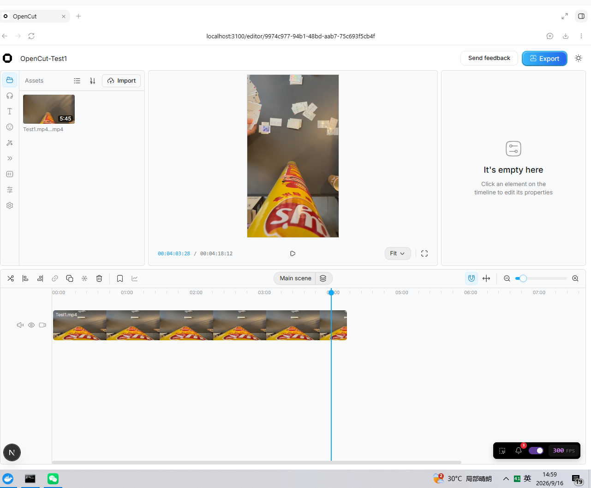

图：OpenCut-Test1 项目的编辑器界面，展示导入素材、剪辑后的时间轴及预览画面。界面显示项目总时码为 00:04:18:12。

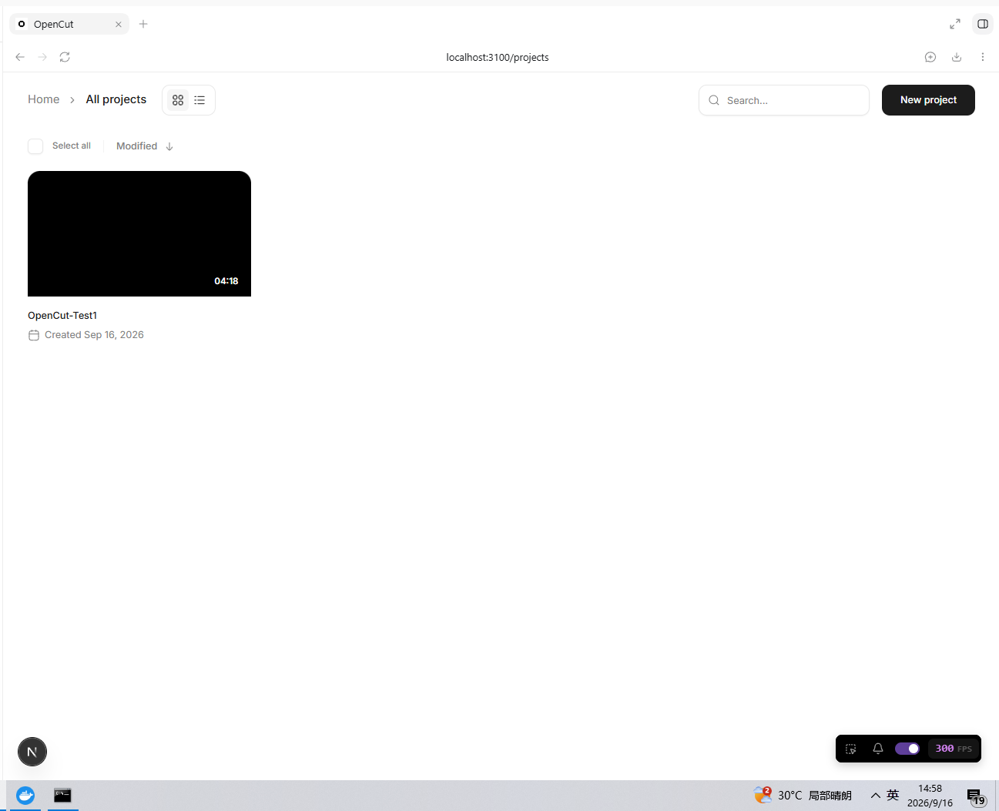

图：项目列表中的 OpenCut-Test1，卡片显示时长为 04:18。

以上截图记录编辑器与项目列表状态。MP4 导出成功、本地播放正常及刷新后恢复正常的结论，依据本次人工操作与检查记录。

### 3.2 主要模块与职责

本节依据提交 `cf5e79e919144200294fb9fed22a222592a0aeea` 的 Web 端源码进行初步调查。下表中的路径均相对于 `apps/web/src/`。

| 模块 | 主要职责 | 源码依据 |
| --- | --- | --- |
| 编辑器核心 | `EditorCore` 集中创建时间轴、项目、素材、播放、渲染和保存等管理器，协调编辑功能。 | `core/index.ts` |
| 项目管理 | 创建、加载和保存项目；加载项目时恢复相关素材。 | `core/managers/project-manager.ts` |
| 素材管理 | 管理素材列表，调用存储服务保存素材，并通过命令机制处理素材删除。 | `core/managers/media-manager.ts` |
| 时间轴编辑 | 提供轨道和片段操作入口，将插入、分割、删除、移动等操作交给对应命令执行。 | `core/managers/timeline-manager.ts`、`commands/timeline/` |
| 命令与历史记录 | 执行编辑命令，维护操作历史和重做栈，提供撤销、重做功能。 | `core/managers/commands.ts` |
| 播放控制 | 管理播放、暂停、当前位置和跳转，并根据时间轴范围调整播放状态。 | `core/managers/playback-manager.ts` |
| 渲染与导出 | 根据轨道和素材构建渲染场景；导出器使用 CanvasRenderer 与 Mediabunny 组织视频帧、音频和输出文件，包含 MP4、WebM 输出实现。 | `core/managers/renderer-manager.ts`、`services/renderer/scene-exporter.ts` |
| 自动保存与本地存储 | 监听场景和时间轴变化，延迟合并保存请求；将项目及素材元数据保存到 IndexedDB，将素材文件保存到 OPFS。 | `core/managers/save-manager.ts`、`services/storage/service.ts` |
| 服务端数据 | 定义用户、会话、账号、验证和反馈等 PostgreSQL 数据表。 | `db/schema.ts` |

#### 自动保存与刷新恢复

`SaveManager` 订阅场景和时间轴变化，默认等待 800 毫秒后尝试保存，以合并短时间内连续发生的编辑操作。实际保存由 `ProjectManager.saveCurrentProject()` 调用存储服务完成。

`StorageService` 使用 IndexedDB 保存项目结构和素材元数据，使用 OPFS（浏览器提供的源私有文件系统）保存素材文件。

这条源码关系为本次“刷新后剪辑结果仍然保留”的实验现象提供了解释。当前调查没有发现上述工程保存流程将时间轴写入 PostgreSQL，不能把数据库启动成功等同于工程已保存到服务器。

#### 调查边界

本节是主要模块职责的初步梳理。撤销与重做、多轨编辑、WebM 导出等功能目前仅确认存在源码实现，尚未逐项进行运行验证。本轮已补充主要预览、音频与导出依赖；Rust/WASM 内部实现及更细的渲染机制仍待调查。

固定版本源码入口：[apps/web/src](https://github.com/OpenCut-app/opencut-classic/tree/cf5e79e919144200294fb9fed22a222592a0aeea/apps/web/src)。

### 3.3 模块依赖图

本图依据提交 `cf5e79e919144200294fb9fed22a222592a0aeea`，展示 Web 编辑器中已核对的主要模块关系。

实线表示调用或使用关系，虚线表示变化通知。图中省略部分辅助模块，以及各管理器通过 EditorCore 相互访问的连接。

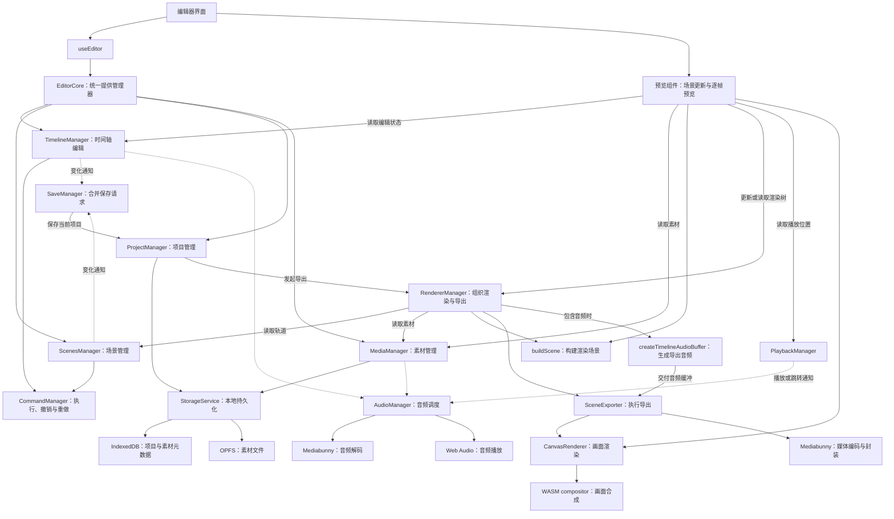

#### 主要关系说明

1. **界面与编辑器核心**：界面通过 `useEditor` 获取 EditorCore，并订阅管理器变化，使显示内容跟随编辑状态更新。
2. **编辑与操作历史**：时间轴和场景管理器将相关编辑操作交给 CommandManager，由命令机制组织执行、撤销和重做。
3. **变化与自动保存**：SaveManager 监听场景和时间轴变化，合并保存请求，再调用项目管理器保存当前项目。
4. **项目与素材持久化**：项目管理器和素材管理器使用 StorageService。项目结构及素材元数据进入 IndexedDB，素材文件进入 OPFS。
5. **渲染与导出**：项目管理器调用 RendererManager，后者读取轨道、素材和项目设置，构建渲染场景并交给 SceneExporter。导出器使用 CanvasRenderer 渲染画面，并使用 Mediabunny 组织媒体输出。

6. **实时预览**：预览组件读取轨道与素材，调用 `buildScene` 更新渲染树；画面刷新时读取 PlaybackManager 的当前位置，调用 CanvasRenderer。预览与导出复用场景构建和画面渲染实现，但调用时机和配置不同，不能据此认定结果已逐帧一致。
7. **音频播放与导出音频**：AudioManager 订阅播放、时间轴及素材变化，使用 Mediabunny 读取音频，并通过 Web Audio 播放。导出时由 RendererManager 在包含音频的条件下生成音频缓冲，再传给 SceneExporter；实时播放和导出并非同一条音频调度路径。

#### 源码依据

以下路径均相对于 `apps/web/src/`：

| 图中关系 | 对应文件 |
| --- | --- |
| 界面获取核心、订阅变化 | `editor/use-editor.ts` |
| 核心创建并提供管理器 | `core/index.ts` |
| 时间轴、场景与命令调用 | `core/managers/timeline-manager.ts`、`core/managers/scenes-manager.ts`、`core/managers/commands.ts` |
| 变化通知与自动保存 | `core/managers/save-manager.ts` |
| 项目保存、加载及导出入口 | `core/managers/project-manager.ts` |
| 素材保存与加载 | `core/managers/media-manager.ts` |
| IndexedDB 与 OPFS 存储分工 | `services/storage/service.ts` |
| 渲染场景与导出组织 | `core/managers/renderer-manager.ts` |
| 渲染器和媒体输出依赖 | `services/renderer/scene-exporter.ts`、`services/renderer/canvas-renderer.ts` |

固定版本源码：[apps/web/src](https://github.com/OpenCut-app/opencut-classic/tree/cf5e79e919144200294fb9fed22a222592a0aeea/apps/web/src)。

本轮补充的可定位依据：

| 新增关系 | 固定版本源码 |
| --- | --- |
| 预览场景构建、播放位置读取和画面渲染 | [preview/components/index.tsx](https://github.com/OpenCut-app/opencut-classic/blob/cf5e79e919144200294fb9fed22a222592a0aeea/apps/web/src/preview/components/index.tsx#L94) |
| 音频对播放、时间轴和素材的订阅 | [audio-manager.ts](https://github.com/OpenCut-app/opencut-classic/blob/cf5e79e919144200294fb9fed22a222592a0aeea/apps/web/src/core/managers/audio-manager.ts#L58) |
| 导出音频缓冲、场景构建及导出器创建 | [renderer-manager.ts](https://github.com/OpenCut-app/opencut-classic/blob/cf5e79e919144200294fb9fed22a222592a0aeea/apps/web/src/core/managers/renderer-manager.ts#L141) |
| 音视频输出与画面渲染调用 | [scene-exporter.ts](https://github.com/OpenCut-app/opencut-classic/blob/cf5e79e919144200294fb9fed22a222592a0aeea/apps/web/src/services/renderer/scene-exporter.ts#L66) |

本图覆盖网页编辑、持久化、实时预览、音频播放和导出的主要关系；为控制图的复杂度，省略了部分核心对管理器的创建连线。字幕、特效、服务端接口和 Rust/WASM 内部实现仍未展开。实线中包含调用、读取和数据传递，具体含义以连线标签及本节说明为准；连线不代表相应功能已逐项运行验证。

### 3.4 关键技术发现与证据

#### 3.4.1 时间轴数据结构与分割机制

本节依据提交 `cf5e79e919144200294fb9fed22a222592a0aeea`。以下源码路径均相对于 `apps/web/src/`。

**1. 项目、场景、轨道与片段分层组织**

`TProject` 包含场景数组 `scenes`、当前场景编号 `currentSceneId` 和项目设置。每个 `TScene` 包含轨道集合 `SceneTracks`。

轨道集合分为主视频轨道 `main`、叠加轨道数组 `overlay` 和音频轨道数组 `audio`；具体轨道通过 `elements` 数组保存片段。

源码依据：`project/types.ts`、`timeline/types.ts`。

**2. 区分时间轴位置与素材裁剪范围**

视频片段 `VideoElement` 通过 `mediaId` 引用素材，并继承以下时间字段：

| 字段 | 含义 |
| --- | --- |
| `id` | 时间轴片段自身的标识 |
| `mediaId` | 片段引用的素材标识 |
| `startTime` | 片段在时间轴上的开始位置 |
| `duration` | 片段在时间轴上占用的时长 |
| `trimStart` | 素材开头被裁去的时长 |
| `trimEnd` | 素材结尾被裁去的时长 |
| `retime` | 可选的变速配置 |

因此，片段在成品中何时出现，与它从原素材哪里开始播放，是两个不同概念。存在变速时，时间轴时长和对应的素材时长也可能不同。

源码依据：`timeline/types.ts`、`commands/timeline/element/split-elements.ts`。

**3. 分割通过修改片段描述实现**

`SplitElementsCommand` 首先检查分割点是否严格位于片段内部。分割点在片段起点、终点或范围之外时，该片段保持不变。

在默认保留左右两侧的情况下：

- 左片段保留原片段标识，缩短 `duration`，增加 `trimEnd`。
- 右片段获得新标识，将 `startTime` 设置为分割位置，更新 `duration` 和 `trimStart`。
- 两个视频片段保留相同的 `mediaId`，继续引用同一素材。
- 代码同时处理变速对应的素材跨度及动画拆分。

例如，假设一段未裁剪、正常速度的 60 秒视频位于时间轴起点，在第 20 秒分割：

| 片段 | 时间轴起点 | 时间轴时长 | 素材开头裁去 | 素材结尾裁去 |
| --- | --- | --- | --- | --- |
| 左片段 | 0 秒 | 20 秒 | 0 秒 | 40 秒 |
| 右片段 | 20 秒 | 40 秒 | 20 秒 | 0 秒 |

该示例用于解释数据含义，不是本次 Test1.mp4 的实际分割记录。分割命令修改的是时间轴数据，不会在此步骤生成两个独立视频文件。

源码依据：`commands/timeline/element/split-elements.ts`。

**4. 删除片段与删除素材是不同操作**

`DeleteElementsCommand` 根据轨道编号和片段编号，从轨道的 `elements` 数组中过滤目标片段，并更新轨道状态。该命令本身没有删除素材文件的调用。

分割和删除命令都会保存操作前的轨道状态，供 `undo()` 恢复。删除后其他片段是否移动，还需结合波纹编辑等逻辑判断，不能仅凭删除命令认定空隙一定自动闭合。

源码依据：`commands/timeline/element/delete-elements.ts`、`commands/timeline/element/split-elements.ts`、`core/managers/commands.ts`。

**5. 内部时间使用整数刻度**

时间字段使用 `MediaTime`。它在 TypeScript 中是带类型标记的数字，表示整数 tick；代码提供秒与内部时间之间的转换函数，以及整数检查和取整函数。

因此，界面显示的“秒”不能直接当作这些字段的原始数值。上面的分割示例以秒展示，实际写入数据时需要转换。

源码依据：`wasm/media-time.ts`。

**对 ClipForge 的启发**

可以借鉴“素材引用、时间轴位置、素材裁剪范围分开记录”的设计，使用户调整剪辑时主要修改结构化数据，在导出阶段再生成成品。这是设计建议，尚未实现 OpenCut 工程与 ClipForge 剪辑清单之间的转换。

固定版本源码：[apps/web/src](https://github.com/OpenCut-app/opencut-classic/tree/cf5e79e919144200294fb9fed22a222592a0aeea/apps/web/src)。
#### 3.4.2 预览与视频导出机制

本节依据提交 `cf5e79e919144200294fb9fed22a222592a0aeea`。以下源码路径均相对于 `apps/web/src/`。

**1. 将时间轴转换成渲染场景**

`buildScene()` 根据轨道、素材和画布设置构建渲染场景。视频片段会转换成 `VideoNode`，其中包含素材引用、时间轴位置、裁剪范围、变速、变换及特效等信息。

因此，时间轴主要记录编辑安排，渲染场景负责组织生成画面所需的数据。

源码依据：`services/renderer/scene-builder.ts`。

**2. 预览根据当前播放位置更新画面**

预览组件中的 `RenderTreeController` 读取轨道、素材和项目设置，调用 `buildScene()` 构建预览场景，并将其交给渲染管理器。

`PreviewCanvas` 使用动画帧循环，读取当前播放位置，再调用 `CanvasRenderer.render()`。如果帧位置和渲染场景均未变化，则跳过重复渲染；已有渲染尚未完成时，也不会再次发起渲染。

源码依据：`preview/components/index.tsx`。

**3. 画面渲染包含状态解析与合成**

`CanvasRenderer.render()` 依次执行：

- 根据指定时间解析渲染节点状态。
- 构建当前帧的描述及所需纹理。
- 向 WASM 合成器同步纹理。
- 调用合成器绘制画面。

预览界面直接挂载合成器提供的输出画布。虽然类名为 CanvasRenderer，其实现还调用了 WASM 合成器，不能仅凭名称将其描述为纯 Canvas 2D 绘制。

源码依据：`services/renderer/canvas-renderer.ts`、`services/renderer/resolve.ts`、`preview/components/index.tsx`。

**4. 导出按帧生成视频并封装文件**

点击导出后，界面调用项目管理器，再由 `RendererManager.exportProject()` 读取当前场景轨道、素材和项目设置，构建导出场景并创建 `SceneExporter`。

`SceneExporter` 根据时长和帧率计算帧数，按顺序渲染每帧，将画布内容和时间戳交给 Mediabunny 的 `CanvasSource`，最后完成文件封装并返回内存缓冲区。界面收到成功结果后调用下载函数。

| 输出格式 | 源码选择的视频编码 | 音频处理 |
| --- | --- | --- |
| MP4 | AVC，即 H.264 | 优先选择 AAC；代码在检测到 AAC 配置不支持时改用 Opus |
| WebM | VP9 | 选择 Opus |

以上是源码配置，不代表所有浏览器和播放器都支持这些组合。本次仅实际验证了 MP4 导出及本地播放，尚未检查成品的音频编码信息，也未测试 WebM。

源码依据：`components/editor/export-button.tsx`、`core/managers/project-manager.ts`、`core/managers/renderer-manager.ts`、`services/renderer/scene-exporter.ts`。

**5. 音频单独准备，再与视频一起输出**

勾选包含音频时，渲染管理器先调用 `createTimelineAudioBuffer()` 准备时间轴音频缓冲区。导出器再通过 Mediabunny 的 `AudioBufferSource` 添加音轨。

所查导出路径在浏览器端组织画面渲染、音频准备和文件生成；该调用链中没有将导出工作提交给 Celery 或服务端 FFmpeg 的步骤。

源码依据：`media/audio.ts`、`core/managers/renderer-manager.ts`、`services/renderer/scene-exporter.ts`。

**预览与导出的区别**

| 对比项 | 预览 | 导出 |
| --- | --- | --- |
| 时间推进 | 跟随当前播放位置 | 按输出帧率依次生成各帧 |
| 输出目标 | 编辑器中的画布 | 可下载的视频文件 |
| 共用部分 | 场景构建与 CanvasRenderer | 场景构建与 CanvasRenderer |
| 特有处理 | 跳过重复帧、响应交互 | 编码、封装、进度及取消处理 |

两者共用部分实现，但预览构建启用了 `isPreview` 分支，例如限制图片源尺寸。因此，共用渲染代码不等于已经证明预览与成品逐像素一致。

**对 ClipForge 的启发与调查边界**

可以参考其做法，让预览和导出使用一致的时间轴语义及场景描述，减少两套逻辑对片段位置、裁剪和特效理解不一致的问题。

本次成品约 4 分 18 秒，人工检查播放正常。尚未测量导出耗时、内存占用、逐帧精度及音画同步误差，也未完整调查 Rust/WASM 合成器内部实现。

固定版本源码：[apps/web/src](https://github.com/OpenCut-app/opencut-classic/tree/cf5e79e919144200294fb9fed22a222592a0aeea/apps/web/src)。

## 4. AutoClip

### 4.1 本地运行与基础流程

#### 实验环境与版本

本次在 Windows 10 环境中，使用 WSL 2 和 Docker Desktop 部署 AutoClip。

- 本地源码目录：`D:\CodeResearch\autoclip`。
- 克隆后记录的提交编号：`aaf863bbd7bba99c64bc53284d41c0ed19034387`。
- Docker Desktop：4.91.0。
- Docker Compose：5.5.1。
- 本地应用镜像：`autoclip:local`。
- 页面访问地址：`http://localhost:8000/`。
- 内容分析：阿里云 DashScope，模型为 `qwen-plus`。
- 语音转写：本地 faster-whisper 1.2.1，使用 base 模型。

#### 部署与准备

完成源码克隆、镜像构建和容器启动。部署过程中通过代理配置解决基础镜像下载失败的问题，并增加前端静态文件挂载配置，使浏览器能够访问操作页面。

模型配置通过环境变量加载。在应用容器中直接调用 DashScope，返回 HTTP 200，确认模型服务能够正常响应。

由于测试素材没有独立字幕文件，另行安装 faster-whisper，并在后台任务容器中完成 base 模型下载与加载检查。

#### 测试操作与结果

通过“文件导入”上传 `Test1.mp4`，页面显示文件大小为 19.30 MB，视频分类选择“娱乐”，未提供独立的 `.srt` 字幕文件。

点击“开始导入并处理”后，系统完成自动语音转写、内容分析和切片生成。项目页面展示了 4 个切片，各自包含标题、简介、评分和时间区间。

| 原视频时间区间 | 切片时长 | 系统评分 |
| --- | --- | --- |
| 00:02–01:00 | 58 秒 | 85 |
| 01:00–02:41 | 1 分 41 秒 | 91 |
| 02:41–03:53 | 1 分 12 秒 | 94 |
| 03:53–05:42 | 1 分 49 秒 | 96 |

随后进行页面预览、文件下载和本地播放检查，结果正常。

本次实验已完成“导入视频 → 自动转写 → AI 分析 → 生成切片 → 预览 → 下载并播放”的基础流程。
#### 切片结果截图

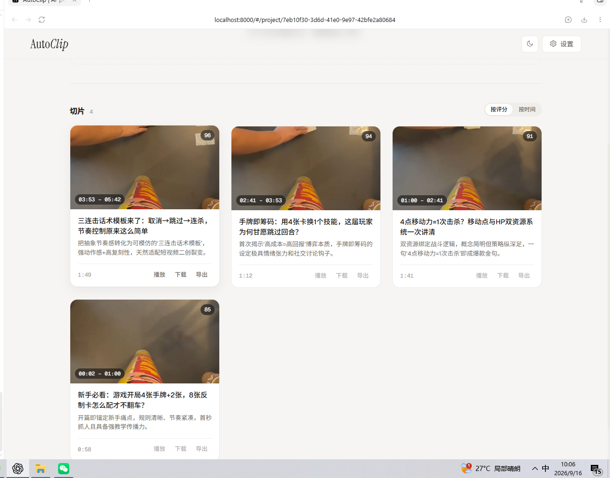

图：本次 Test1.mp4 实验生成的 4 个切片，页面展示标题、评分及时间范围。已人工验证预览、下载和本地播放正常。原视频及下载切片保留在本地，未上传仓库。
#### 验证范围

本次结论基于单个视频样本和人工播放检查。尚未系统评估字幕准确率、切点自然度、处理耗时、资源占用及多任务并发能力。

上述评分为系统生成的评分，不是人工质量评价。四个切片连续覆盖原视频的一个时间区间，尚不能据此证明系统实现了高压缩率的精彩片段筛选。

### 4.2 后端任务编排

#### 调查范围

本次调查文件导入入口、字幕准备和视频处理任务的提交关系，依据本地提交 `aaf863bbd7bba99c64bc53284d41c0ed19034387` 的源码。

以下为源码调用关系调查，尚未通过运行日志逐项核对本次实验实际经过的全部分支。

#### 1. 前端提交视频与项目信息

`frontend/src/components/FileUpload.tsx` 调用 `projectApi.uploadFiles()`。

该方法在 `frontend/src/services/api.ts` 中定义，将视频、可选字幕、项目名称和视频分类组成表单，提交到 `/projects/upload` 接口。

前端收到项目响应后，将项目加入列表并提示后台正在处理。这个提示本身不能证明后台任务已经成功执行。

#### 2. 上传接口创建项目并准备文件

`backend/api/v1/projects.py` 中的 `upload_files()` 负责检查文件扩展名、创建项目记录，并将视频保存到项目原始素材目录。

如果用户提供字幕，也会保存字幕文件。接口还会同步尝试生成缩略图，因此上传请求并非只负责提交后台任务。

源码中随后安排调用 `process_import_task.delay()`，将项目编号、视频路径和可选字幕路径交给 Celery。

#### 3. 导入任务准备字幕

`backend/tasks/import_processing.py` 中的 `process_import_task()` 负责检查缩略图，并在缺少字幕时调用语音识别功能生成字幕。

字幕准备完成后，该任务调用 `submit_video_pipeline_task()`，提交后续视频处理任务。

这里的“导入处理完成”表示字幕等准备工作完成、后续处理已提交，不等同于最终切片已经生成。

#### 4. Redis 与 Celery 分配后台任务

`backend/core/celery_app.py` 配置 Redis 作为 Celery 的消息代理和结果后端，将导入任务及视频处理任务路由到 `processing` 队列。

可以将其理解为：

- 应用提交任务消息。
- Redis 保存和传递队列消息。
- Celery worker 接收任务并执行具体处理。

`backend/utils/task_submission_utils.py` 在非 Desktop 模式下，通过 `celery_app.send_task()` 提交 `backend.tasks.processing.process_video_pipeline`。

该工具另有 Desktop 模式的本地线程执行分支，不能将两种部署方式混为一谈。

#### 5. 视频处理任务执行并保存结果状态

`backend/tasks/processing.py` 中的 `process_video_pipeline()` 创建数据库任务记录，并调用 `simple_pipeline_adapter` 执行后续处理。

处理结束后，根据返回结果更新任务和项目状态。成功分支将任务进度设置为 100，并记录项目完成时间；失败分支保存错误信息。

本轮已补充适配器六步处理、文件结果同步，以及前端定时查询进度快照的关系，见第 4.4 节；各步骤算法内部与全部异常分支仍未逐项验证。

#### 待复核的入口问题

当前源码的 `upload_files()` 在提交导入任务前使用了 `db.query(...)`，但该函数内未发现 `db` 的定义或注入；此前访问数据库使用的是 `project_service.db`。

这一处存在触发未定义变量异常的风险。该异常会被任务提交部分的异常处理捕获，而接口仍可能返回项目创建成功。

因此，需要进一步比对运行容器中的代码和任务记录，确认实际实验的执行路径。不能仅凭页面“项目创建成功”的提示，认定后台提交一定成功；本次实验最终生成并播放切片，是另一个独立的运行结果证据。
#### 上传入口问题与另一条启动路径

已检查运行容器中的 `backend/api/v1/projects.py`，第 126 行同样使用 `db.query(...)`，与本地源码一致。本地上传函数中未发现该变量的定义或注入，因此存在任务提交前触发未定义变量异常的问题。

上传接口捕获该异常后，仍可能返回项目创建成功。因此，“项目创建成功”与“后台任务提交成功”需要分别判断。

进一步检查本地前端源码，发现另一条启动路径：

1. 首页上传成功后刷新项目列表。
2. `ProjectCard.tsx` 检测到项目状态为 `pending`、未处于下载中，且尚未自动尝试启动时，调用 `handleRetry({ silent: true })`。
3. 对于 `pending` 项目，该函数调用 `projectApi.startProcessing()`，请求 `/projects/{project_id}/process`。
4. 后端 `start_processing()` 直接提交 `process_video_pipeline` 任务。
5. `simple_pipeline_adapter.py` 在没有可用字幕时，也会尝试自动生成字幕，然后继续处理。

这条路径可以解释为何上传接口存在问题，但项目仍有机会完成处理。

需要区分证据范围：容器中的问题语句已经核对；另一条启动路径已通过本地源码确认。本次实验是否实际由该路径启动，尚未通过请求或任务日志逐项验证，当前属于基于源码的解释。

相关源码：

- `frontend/src/pages/HomePage.tsx`
- `frontend/src/components/ProjectCard.tsx`
- `frontend/src/services/api.ts`
- `backend/api/v1/projects.py`
- `backend/services/simple_pipeline_adapter.py`

#### 源码依据

- `frontend/src/components/FileUpload.tsx`
- `frontend/src/services/api.ts`
- `backend/api/v1/projects.py`
- `backend/tasks/import_processing.py`
- `backend/core/celery_app.py`
- `backend/utils/task_submission_utils.py`
- `backend/tasks/processing.py`

### 4.3 LLM 调用层

#### 调查范围

本次依据本地提交 `aaf863bbd7bba99c64bc53284d41c0ed19034387`，调查字幕进入分析流程后，业务步骤如何调用模型服务及处理返回结果。

本次实验配置的提供商为 DashScope，模型为 `qwen-plus`。以下调用结构来自源码检查，尚未逐次核对实验中的模型请求和原始响应。

#### 1. 分阶段分析字幕与片段信息

`simple_pipeline_adapter.py` 组织大纲提取、时间定位、内容评分、标题生成、主题聚类和视频生成等步骤。

| 阶段 | 主要输入 | 模型参与的工作 |
| --- | --- | --- |
| 大纲提取 | 字幕解析后得到的文本块 | 提取话题大纲 |
| 时间定位 | 话题大纲及对应字幕块 | 确定话题对应的时间范围和内容 |
| 内容评分 | 片段大纲、内容和起止时间 | 生成评分及推荐信息 |
| 标题生成 | 片段编号、大纲、内容及推荐理由 | 生成切片标题等信息 |
| 主题聚类 | 切片标题、摘要和评分等 | 组织主题合集 |

大纲提取阶段先解析 SRT，再根据素材时长进行分块，并逐块调用模型。因此，不能仅凭设置页面显示的“5000 字符”，认定当前流程固定按 5000 字符分块。

各阶段采用不同的提示词和输入数据，并非一次模型调用直接完成全部剪辑。

#### 2. 模型调用的分层关系

已确认的主要调用关系为：

`业务步骤 → LLMClient → LLMManager → 具体提供商 → 模型服务`

各层职责：

- **业务步骤**：准备提示词、字幕或片段数据，并处理阶段结果。
- **LLMClient**：为业务步骤提供统一调用入口，以及 JSON 响应解析方法。
- **LLMManager**：加载配置、选择提供商、转发调用，并处理部分调用异常与重试。
- **DashScopeProvider**：拼接提示词与输入数据，发送请求并提取模型返回文本。

这些层分别位于：

- `backend/pipeline/step1_outline.py` 至 `step5_clustering.py`
- `backend/utils/llm_client.py`
- `backend/core/llm_manager.py`
- `backend/core/llm_providers.py`

#### 3. DashScope 请求与返回

`DashScopeProvider` 支持原生 SDK 和 OpenAI 兼容接口两种调用方式，代码默认使用原生 SDK。

在原生方式中，它将提示词与输入数据组合后，通过 `Generation.call()` 传入模型名称、API Key 和提示内容，再从响应中提取文本。

本次部署曾直接调用该 SDK，并获得 HTTP 200。这证明测试请求成功，但不能代替对整条流程中每次模型调用的验证。

#### 4. 响应解析与后续处理

模型首先返回文本，各业务步骤再进行结构化解析、字段对齐或其他处理，供后续步骤使用。

例如：

- 大纲提取结果附加文本块编号，随后进行合并。
- 评分步骤解析响应后，将返回评分与原片段对齐。
- 标题步骤根据片段编号将生成结果关联回片段。
- 部分步骤保存原始响应及中间 JSON 文件，便于检查。

模型返回内容并不保证始终格式正确。代码中存在重试、解析失败处理及部分兜底逻辑，但尚未系统验证这些机制的效果。

`LLMManager.call_with_retry()` 默认最多尝试 3 次调用；遇到 `ValueError` 时直接抛出，其他异常按条件等待后重试。这里是最多 3 次尝试，不是首次调用之外再重试 3 次。

#### 5. 文本分析与视频切割的职责

在本次调查的路径中，Whisper 负责语音转写，LLM 负责基于文本生成大纲、时间范围、评分、标题和主题信息。

最终视频生成由 `step6_video.py` 调用 `VideoProcessor` 完成，底层使用 FFmpeg。模型输出需要经过程序处理，才能成为实际视频文件。

因此，字幕准确性、模型输出质量、时间范围处理和视频切割实现都会影响最终成片。

#### 当前边界与待补事项

- 尚未逐项分析各类提示词及其对输出的影响。
- 尚未量化模型调用次数、Token 用量、费用和耗时。
- 尚未系统验证 JSON 解析失败、空响应和重试后的处理结果。
- 尚未核对本次 4 个切片对应的全部中间文件。
- 模型评分不等同于人工质量评价，生成的标题与摘要仍需核实。

补充源码依据：

- `backend/services/simple_pipeline_adapter.py`
- `backend/pipeline/step6_video.py`
- `backend/utils/video_processor.py`

### 4.4 模块依赖图

#### 分析、输出与进度的主要关系

本图依据提交 `aaf863bbd7bba99c64bc53284d41c0ed19034387`。实线表示调用、查询或文件读写；虚线表示进度上报。六步流水线是适配器组织的正常内容处理分支，空大纲时会跳过部分步骤。

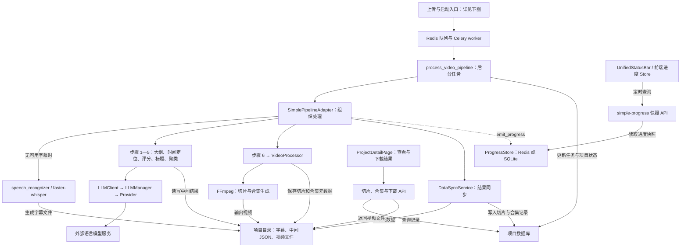

这张图补充了四项容易混淆的职责：

1. **AI 与媒体处理分开**：语音模型生成字幕；语言模型参与内容分析和候选组织；FFmpeg 根据处理结果生成视频。借鉴时可直接集成这些成熟组件，不需要自行训练模型或开发编码器。
2. **文件与数据库分开**：流水线先产生项目目录中的中间结果与视频，再由 DataSyncService 读取元数据，写入切片、合集等数据库记录。视频文件本身不作为数据库记录保存。
3. **进度与结果分开**：已确认 UnifiedStatusBar 使用前端进度 Store 定时查询快照 API。服务端进度存储优先使用 Redis，桌面模式使用 SQLite，初始化失败时尝试降级。这里只确认这一条进度链路，不概括项目内其他 WebSocket 实现。
4. **结果查询与下载分开**：详情页通过切片和合集 API 获取记录，通过下载接口取得视频文件；因此“后台执行结束”与“结果可查询、文件可下载”需要分别核对。

#### 新增关系的源码依据

| 关系 | 固定版本源码 |
| --- | --- |
| 后台任务调用适配器并更新状态 | [processing.py](https://github.com/zhouxiaoka/autoclip/blob/aaf863bbd7bba99c64bc53284d41c0ed19034387/backend/tasks/processing.py#L65) |
| 字幕准备、六步处理和结果同步 | [simple_pipeline_adapter.py](https://github.com/zhouxiaoka/autoclip/blob/aaf863bbd7bba99c64bc53284d41c0ed19034387/backend/services/simple_pipeline_adapter.py#L111) |
| 本地 Whisper 调用 | [speech_recognizer.py](https://github.com/zhouxiaoka/autoclip/blob/aaf863bbd7bba99c64bc53284d41c0ed19034387/backend/utils/speech_recognizer.py#L374) |
| 模型调用分层 | [llm_client.py](https://github.com/zhouxiaoka/autoclip/blob/aaf863bbd7bba99c64bc53284d41c0ed19034387/backend/utils/llm_client.py#L37)、[llm_manager.py](https://github.com/zhouxiaoka/autoclip/blob/aaf863bbd7bba99c64bc53284d41c0ed19034387/backend/core/llm_manager.py#L287) |
| 第六步与视频处理器 | [step6_video.py](https://github.com/zhouxiaoka/autoclip/blob/aaf863bbd7bba99c64bc53284d41c0ed19034387/backend/pipeline/step6_video.py#L11)、[video_processor.py](https://github.com/zhouxiaoka/autoclip/blob/aaf863bbd7bba99c64bc53284d41c0ed19034387/backend/utils/video_processor.py#L129) |
| 文件结果同步到数据库 | [data_sync_service.py](https://github.com/zhouxiaoka/autoclip/blob/aaf863bbd7bba99c64bc53284d41c0ed19034387/backend/services/data_sync_service.py#L66) |
| 进度上报和存储选择 | [simple_progress.py](https://github.com/zhouxiaoka/autoclip/blob/aaf863bbd7bba99c64bc53284d41c0ed19034387/backend/services/simple_progress.py#L153) |
| 前端轮询与快照接口 | [UnifiedStatusBar.tsx](https://github.com/zhouxiaoka/autoclip/blob/aaf863bbd7bba99c64bc53284d41c0ed19034387/frontend/src/components/UnifiedStatusBar.tsx#L27)、[useSimpleProgressStore.ts](https://github.com/zhouxiaoka/autoclip/blob/aaf863bbd7bba99c64bc53284d41c0ed19034387/frontend/src/stores/useSimpleProgressStore.ts#L55)、[快照 API](https://github.com/zhouxiaoka/autoclip/blob/aaf863bbd7bba99c64bc53284d41c0ed19034387/backend/api/v1/simple_progress.py#L16) |
| 详情页查询及下载调用 | [ProjectDetailPage.tsx](https://github.com/zhouxiaoka/autoclip/blob/aaf863bbd7bba99c64bc53284d41c0ed19034387/frontend/src/pages/ProjectDetailPage.tsx#L53)、[api.ts](https://github.com/zhouxiaoka/autoclip/blob/aaf863bbd7bba99c64bc53284d41c0ed19034387/frontend/src/services/api.ts#L317)、[下载接口](https://github.com/zhouxiaoka/autoclip/blob/aaf863bbd7bba99c64bc53284d41c0ed19034387/backend/api/v1/projects.py#L1256) |

#### 文件导入与任务启动的局部关系图

本图依据本地源码绘制，覆盖文件上传、两条任务启动路径及视频处理入口，尚未覆盖完整系统。

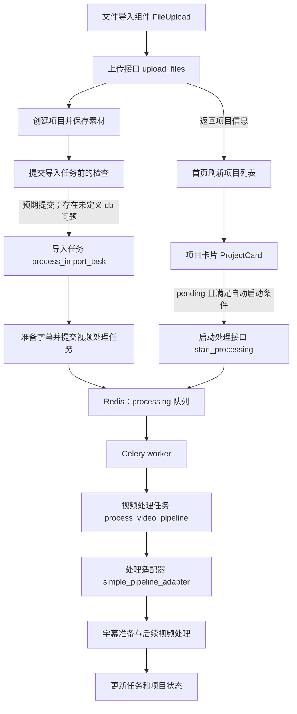

#### 图示说明

- 上传接口负责创建项目、保存文件，并尝试提交导入任务。
- 图中虚线表示存在已发现问题的预期调用：任务提交前的 `db.query(...)` 可能触发异常，不能视为已经成功执行。
- 导入任务本身也是由 Celery 经 `processing` 队列交给 worker 执行；图中为便于阅读，未重复展开这一段队列关系。
- 项目卡片另有自动启动逻辑，可以调用独立的处理接口，直接提交视频处理任务。
- 视频处理适配器在缺少字幕时，也会尝试自动生成字幕。
- 两条启动路径来自源码调查；尚未通过日志确认本次实验实际经过的完整路径。

#### 调查边界与依据

上图专门保留两条任务入口及已发现的问题；本节前一张图补充分析、视频生成、结果同步与进度查询。两张图合起来描述已核对的主要处理关系，未覆盖所有媒体来源、发布渠道和异常恢复分支，也不证明实验实际走过全部路径。

源码依据：

- `frontend/src/components/FileUpload.tsx`
- `frontend/src/pages/HomePage.tsx`
- `frontend/src/components/ProjectCard.tsx`
- `frontend/src/services/api.ts`
- `backend/api/v1/projects.py`
- `backend/core/celery_app.py`
- `backend/tasks/import_processing.py`
- `backend/utils/task_submission_utils.py`
- `backend/tasks/processing.py`
- `backend/services/simple_pipeline_adapter.py`

### 4.5 关键技术发现与证据

#### 部署问题与处理结果

| 问题 | 排查与处理 | 当前结果 |
| --- | --- | --- |
| 基础镜像下载失败 | 构建时访问 Docker Hub 认证接口超时；配置 Docker Desktop 代理，分别拉取 Node 和 Python 基础镜像后重新构建。 | 本次构建成功。 |
| 原启动方式未提供前端页面 | 镜像中已有前端构建文件，通过额外的 Compose 配置，在 FastAPI 中挂载前端静态文件目录。 | 可以访问首页及项目页面。 |
| 网页模型连接测试返回 HTTP 400 | 检查发现设置接口限制在 Desktop 模式使用；改用环境变量配置，并在容器中直接调用 DashScope 验证。 | 实际请求返回 HTTP 200；网页接口限制尚未修复。 |
| 缺少语音转写组件 | 在共享数据目录安装 faster-whisper，下载 base 模型，并在后台任务容器中检查模型加载。 | 检查通过，随后完成无外部字幕视频的处理。 |
| Celery worker、beat 显示不健康 | 它们沿用了面向 HTTP 服务的健康检查，该检查不适合直接判断这些后台进程的状态。 | 健康检查待修正；本次视频任务已成功处理。 |
| Flower 反复重启 | 启动命令提示不存在 flower 子命令，当前镜像缺少相应组件。 | 可选监控组件待处理，本次基础流程已完成。 |

#### 发现的实现限制

1. 设置接口存在 Desktop 模式限制，Docker 部署不能直接依赖网页完成全部配置。
2. 语音运行时采用跨平台的 faster-whisper，但安装接口仍存在 macOS 平台限制。本次通过命令完成安装，接口本身尚未修复。
3. DashScope 调用代码存在将完整 API Key 写入日志的语句，需删除或脱敏。实验报告及共享日志不应包含真实密钥。

#### 补充发现：完成状态与有效产物需要分别判断

在适配器源码中，无可用字幕且自动生成字幕未成功时，会写入空大纲；空大纲分支跳过后续分析与视频生成，将 `video_result.status` 设为 `skipped`。流程随后仍上报 `DONE`，并返回外层 `status: succeeded`。此外，`DONE` 在数据库同步之前上报，同步异常仅记录日志，不会直接改变这次返回的成功状态。

这是静态源码发现的潜在误报成功和结果可见性风险，尚未通过故障注入复现；不表示本次成功生成的 4 个切片受到影响。对 ClipForge 的设计启发是：分别记录处理状态、有效片段数量、视频生成状态和结果入库状态；只有满足产品定义的成功条件后才向用户展示可用结果。无需为此开发新算法。

依据：[适配器的空结果与同步分支](https://github.com/zhouxiaoka/autoclip/blob/aaf863bbd7bba99c64bc53284d41c0ed19034387/backend/services/simple_pipeline_adapter.py#L152)。

#### 对 ClipForge 的启发

- 应分别检查模型服务、转写组件、模型文件和后台任务是否可用，再允许用户开始处理。
- 前端应显示具体失败原因，避免只展示 HTTP 状态码，让用户误判为密钥错误。
- Web 服务与后台任务应使用各自适用的健康检查。
- 部署说明应明确区分桌面模式和 Docker 模式，并列出额外下载的组件及模型。
- 日志应记录排查所需的信息，同时避免输出完整密钥。

以上为结合本次实验提出的设计建议，不表示 AutoClip 已实现这些改进。

#### 证据与源码位置

实验依据包括镜像构建输出、容器状态、DashScope 请求返回的 HTTP 200、转写组件安装结果、切片结果截图及人工播放检查。

本次检查涉及以下源码文件：

- `docker-compose.yml`：服务编排、共享目录及健康检查。
- `Dockerfile`：镜像构建、依赖安装与前端构建产物。
- `backend/api/v1/settings.py`：设置接口的运行模式限制。
- `backend/api/v1/speech_recognition.py`：语音组件安装接口的平台判断。
- `backend/services/whisper_runtime.py`：转写组件安装目录及模型缓存管理。
- `backend/utils/speech_recognizer.py`：本地 Whisper 模型加载与字幕生成。
- `backend/core/llm_providers.py`：模型调用及日志输出。

项目源码来源：https://github.com/zhouxiaoka/autoclip

本次额外添加的前端启动配置为 `docker-compose.frontend.yml`，属于本地部署补充配置。
#### 数据模型的初步调查

源码通过 SQLAlchemy 定义项目、任务和切片等数据库模型。本次重点检查三个模型：

| 模型 | 主要记录内容 | 关联方式 |
| --- | --- | --- |
| Project（项目） | 名称、状态、视频路径、字幕路径、处理配置及完成时间 | 关联多个任务和切片 |
| Task（任务） | 任务类型、状态、进度、当前步骤、Celery 任务编号、错误信息及处理结果 | 通过 project_id 关联项目 |
| Clip（切片） | 标题、描述、起止时间、时长、评分、推荐理由及输出视频路径 | 通过 project_id 关联项目 |

这些对象分别回答三个问题：

- 项目：正在处理哪份素材，总体状态是什么？
- 任务：后台正在做什么，执行到哪一步，是否失败？
- 切片：选中了哪段内容，生成的文件在哪里？

模型中的 video_path、subtitle_path 等字段记录文件路径。结合前面调查的文件写入流程，可以看到系统同时使用数据库与文件系统：数据库保存业务记录和关联，文件系统保存视频、字幕及部分中间结果。

需要注意，Clip 模型将起止时间和时长声明为以秒为单位的 Integer 字段。当前只确认了模型声明，尚未核对写入时的小数处理及最终切点精度，不能据此声称支持逐帧精度。

当前调查仅覆盖主要字段与关联，尚未完整检查数据库迁移、文件与数据库的一致性、删除清理及异常恢复。

源码依据：

- `backend/models/project.py`
- `backend/models/task.py`
- `backend/models/clip.py`
- `backend/api/v1/projects.py`
#### 许可证初步调查

本次核对提交 `aaf863bbd7bba99c64bc53284d41c0ed19034387`，仓库根目录的 `LICENSE` 为 MIT License，版权声明为 `Copyright (c) 2024 AutoClip Team`。

`pyproject.toml` 和 README 也将项目许可证标为 MIT，与许可证文件一致。

许可证文本允许使用、修改和分发等行为，同时要求在软件副本或实质性部分中保留版权声明及许可声明，并包含无担保条款。

本次核对的是 AutoClip 项目自身的许可证。依赖库、模型文件及外部模型服务的许可或使用条款，需要分别核对，不能统一视为 MIT。

源码依据：

- [固定提交的 LICENSE](https://github.com/zhouxiaoka/autoclip/blob/aaf863bbd7bba99c64bc53284d41c0ed19034387/LICENSE)
- [固定提交的 pyproject.toml](https://github.com/zhouxiaoka/autoclip/blob/aaf863bbd7bba99c64bc53284d41c0ed19034387/pyproject.toml)

## 5. Shotcut / MLT

### 5.1 本地运行与基础流程
使用 Shotcut 26.8.1 导入素材 Sucai1.mp4，进行分割并移除中间部分，保留两个片段。将结果保存为 Week1Work.mlt，关闭后重新打开，确认工程可以恢复剪辑结果。
工程分辨率为 960 × 600，帧率为 30 fps。

#### 运行方式与完成范围

本次在 Windows 10 环境中使用已安装的 Shotcut 26.8.1，完成素材导入、片段剪辑、工程保存和重新打开。

已使用 Git 克隆 Shotcut 官方源码仓库，本地位置为 `D:\CodeResearch\shotcut`。

已将本地源码切换到提交 `8cd39efcdf8ab80390ee4736db2f52577fc82cdc`，并通过 `git rev-parse HEAD` 核对，输出与报告记录一致。

当前已完成软件基础使用实验、源码克隆和部分源码阅读。尚未从源码编译运行 Shotcut，也未单独部署 MLT。本地安装的软件与所查源码提交是否对应同一发布版本，尚未核对。
#### MP4 导出与播放验证

将 Week1Work.mlt 的时间轴导出为 MP4，并使用视频播放器打开检查。

人工检查结果：
- 视频可以正常播放，画面和声音正常。
- 被删除的中间部分未出现在成品中。
- 两个保留片段按预期顺序连接。

本次验证表明，该样本已完成“导入素材 → 剪辑 → 保存并重新打开工程 → 导出视频 → 播放检查”的基础流程。

检查范围仅限本次样本的人工播放观察，尚未进行逐帧精度或音画同步误差测量。

### 5.2 工程文件读写
查看 Week1Work.mlt 后，发现工程使用 XML 格式记录素材引用和剪辑安排：
resource 属性记录原始素材的文件路径。
两个素材引用 chain0 和 chain1 均指向 Sucai1.mp4。
playlist0 对应名为 V1 的视频轨道。
轨道中的两条 entry 按顺序播放，分别选取原素材的 00:00:00.000—00:00:20.000 和 00:00:30.600—00:00:41.233。
in、out 表示原素材中的起止位置，out 包含结束帧。
初步理解：工程通过“素材引用＋片段范围＋排列顺序”保存剪辑结果，重新打开时仍需能够找到原素材。
依据：
本次实验文件：Week1Work.mlt 中的 resource、playlist0 和 entry。
MLT XML 官方文档：https://www.mltframework.org/docs/mltxml/
MLT 起止点与时长说明：https://www.mltframework.org/docs/mvcp/
#### 保存工程的源码初步调查

早期从 Shotcut 官方仓库的 master 分支定位 `src/mltcontroller.cpp` 中的 `Controller::saveXML(...)` 函数；后续调查已记录固定提交，本文相关源码引用统一使用第 2 节的提交编号。

该函数使用 MLT 的 XML Consumer 生成工程 XML，并设置时间表示、工程标题等属性。在普通文件保存分支中，生成的 XML 经处理和校验后，通过 `QTextStream` 写入文件，最后调用 `QSaveFile::commit()` 完成保存。

其中，`time_format` 设置为 `clock`，与本次 Week1Work.mlt 样本中观察到的时钟格式时间值一致。

源码依据：[固定版本的工程控制器](https://github.com/mltframework/shotcut/blob/8cd39efcdf8ab80390ee4736db2f52577fc82cdc/src/mltcontroller.cpp)。

版本说明：源码提交已记录为 `8cd39efcdf8ab80390ee4736db2f52577fc82cdc`；本地实验使用 Shotcut 26.8.1。尚未确认该提交与安装版本对应同一发布版本。

当前进度：已初步调查普通文件保存、工程打开，以及主窗口取得时间轴对象并调用保存控制器的关系，见本节后续内容；MLT 内部解析与完整界面恢复流程仍需进一步调查。
#### 打开工程的源码初步调查

在 `src/mltcontroller.cpp` 中定位到 `Controller::open(...)` 函数。

该函数先调用 `checkFile()` 检查文件；检查未报告错误后，关闭当前内容。对于 `.mlt` 文件，它会处理路径编码，然后通过 `Mlt::Producer` 创建读取对象，并检查对象是否有效。

读取成功后，函数根据条件更新工程和预览参数，并读取工程中保存的音频声道数、处理模式。本次 Week1Work.mlt 样本包含相应的 `shotcut:projectAudioChannels` 和 `shotcut:processingMode` 属性，可与这一读取流程对照。

该函数返回整数错误码：正常流程返回 0；读取对象无效时设为 1；文件检查失败时返回检查得到的错误码。

初步结论：这段代码通过 MLT 读取工程，而不是自行逐项解析 XML。MLT 内部解析以及界面时间轴恢复流程尚待进一步调查。

源码依据：[固定版本的工程控制器](https://github.com/mltframework/shotcut/blob/8cd39efcdf8ab80390ee4736db2f52577fc82cdc/src/mltcontroller.cpp)。
#### 主窗口与保存控制器的调用关系

在 `src/mainwindow.cpp` 中定位到 `MainWindow::saveXML(...)` 函数。该函数根据当前工程状态选择保存对象，再调用 `MLT.saveXML(...)` 执行保存。

当时间轴模型中存在轨道时，函数传入 `multitrack()`，保存多轨时间轴。本次样本包含 V1 轨道及两个片段，对应这一分支。其他分支分别处理播放列表、其他有效内容对象和空工程。

初步确认的分工为：

- `MainWindow::saveXML`：选择保存内容，并传递文件名、路径选项和工程备注。
- `Controller::saveXML`：生成工程 XML，在普通文件保存流程中将其写入文件。

源码依据：
[https://github.com/mltframework/shotcut/blob/master/src/mainwindow.cpp](https://github.com/mltframework/shotcut/blob/8cd39efcdf8ab80390ee4736db2f52577fc82cdc/src/mainwindow.cpp)
[https://github.com/mltframework/shotcut/blob/master/src/mltcontroller.cpp
](https://github.com/mltframework/shotcut/blob/8cd39efcdf8ab80390ee4736db2f52577fc82cdc/src/mltcontroller.cpp)
当前已确认这两个函数之间的调用关系，保存按钮到主窗口保存函数的调用路径尚待调查。
#### 保存操作入口与调用流程

在 `src/mainwindow.cpp` 中定位到 `MainWindow::on_actionSave_triggered()`。

该函数先停止时间轴录制。如果当前工程没有保存路径，则进入“另存为”流程；如果已有路径，则在通过可写检查后调用定期备份逻辑，再执行 `saveXML(m_currentFile)`。

已确认的已有路径保存调用链为：

`MainWindow::on_actionSave_triggered()` → `MainWindow::saveXML(...)` → `Controller::saveXML(...)`

三个函数分别承担保存操作处理、保存对象选择、XML 生成与文件写入的职责。

保存后，入口函数重新建立自动保存对象、更新窗口和撤销历史状态，并根据 `success` 显示成功消息或错误提示。

观察到的细节：已有路径分支末尾返回固定值 `true`，而不是 `success`，因此不能仅凭该入口函数返回 `true` 判断文件保存成功。

源码依据：
[https://github.com/mltframework/shotcut/blob/master/src/mainwindow.cpp](https://github.com/mltframework/shotcut/blob/8cd39efcdf8ab80390ee4736db2f52577fc82cdc/src/mainwindow.cpp)
[https://github.com/mltframework/shotcut/blob/master/src/mltcontroller.cpp](https://github.com/mltframework/shotcut/blob/8cd39efcdf8ab80390ee4736db2f52577fc82cdc/src/mltcontroller.cpp)

当前范围：已追踪保存操作处理函数到文件写入的主要路径；尚未核对界面动作绑定，“另存为”内部流程也未展开调查。
### 5.3 模块依赖图

本图依据提交 `8cd39efcdf8ab80390ee4736db2f52577fc82cdc`，覆盖时间轴编辑、工程保存、播放控制、滤镜挂接和普通后台导出的主要关系。箭头表示调用、持有、数据传递或任务调度，以标签为准；不表示每个模块都在单独的进程中。

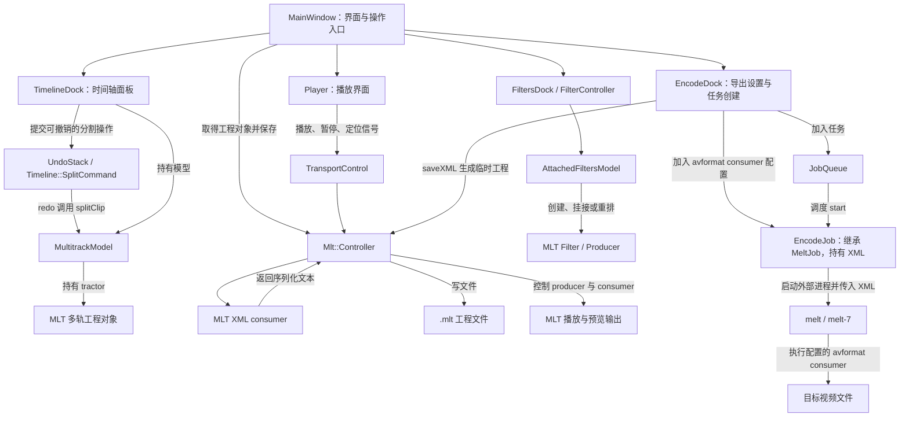

#### 主要关系说明

1. **编辑与工程对象**：TimelineDock 持有 MultitrackModel；以分割操作为例，界面向撤销栈提交 SplitCommand，其 `redo()` 调用模型的 `splitClip()`。模型持有 MLT 多轨对象，主窗口通过 `m_timelineDock->model()->tractor()` 取得它，供保存等流程使用。
2. **工程保存**：主窗口选择保存对象后调用 Controller 的 `saveXML()`，经 MLT XML consumer 生成文本，再在普通保存分支写入工程文件。保存工程记录编辑结构，不等于导出成品。
3. **播放控制**：Player 在素材打开后的处理函数中连接 `MLT.transportControl()`；播放、暂停和定位信号交给 TransportControl，再转给 Controller。Controller 调整 producer 状态并控制 consumer。此处确认的是控制链，未展开图像像素处理、GPU 合成及各平台显示实现。
4. **滤镜挂接**：FilterController 管理当前服务及附加滤镜模型，AttachedFiltersModel 创建 MLT Filter，并将服务挂接或重排到 producer 上。此处确认的是滤镜组织机制，没有分析某个滤镜的图像算法或实际效果质量。
5. **后台导出**：EncodeDock 生成临时 XML 并写入目标文件、`avformat` consumer 等配置，创建 EncodeJob 并交给 JobQueue。调度后 MeltJob 启动外部 `melt` 程序执行；Linux 分支程序名为 `melt-7`。图中概括普通后台导出，未穷举实时输出和重构图等特殊分支。

#### 可定位的源码依据

| 图中关系 | 固定版本源码 |
| --- | --- |
| 主窗口创建播放器、时间轴、滤镜和导出面板 | [mainwindow.cpp](https://github.com/mltframework/shotcut/blob/8cd39efcdf8ab80390ee4736db2f52577fc82cdc/src/mainwindow.cpp#L323) |
| 时间轴提交分割命令 | [timelinedock.cpp](https://github.com/mltframework/shotcut/blob/8cd39efcdf8ab80390ee4736db2f52577fc82cdc/src/docks/timelinedock.cpp#L1143) |
| 分割命令调用模型 | [timelinecommands.cpp](https://github.com/mltframework/shotcut/blob/8cd39efcdf8ab80390ee4736db2f52577fc82cdc/src/commands/timelinecommands.cpp#L1538) |
| 模型持有及返回 MLT tractor | [multitrackmodel.h](https://github.com/mltframework/shotcut/blob/8cd39efcdf8ab80390ee4736db2f52577fc82cdc/src/models/multitrackmodel.h#L101) |
| 播放信号连接及接收者选择 | [player.cpp](https://github.com/mltframework/shotcut/blob/8cd39efcdf8ab80390ee4736db2f52577fc82cdc/src/player.cpp#L453)、[连接位置](https://github.com/mltframework/shotcut/blob/8cd39efcdf8ab80390ee4736db2f52577fc82cdc/src/player.cpp#L967) |
| 播放控制转发及 consumer 控制 | [mltcontroller.cpp](https://github.com/mltframework/shotcut/blob/8cd39efcdf8ab80390ee4736db2f52577fc82cdc/src/mltcontroller.cpp#L1906)、[play 实现](https://github.com/mltframework/shotcut/blob/8cd39efcdf8ab80390ee4736db2f52577fc82cdc/src/mltcontroller.cpp#L230) |
| 滤镜控制器及服务挂接 | [filtercontroller.cpp](https://github.com/mltframework/shotcut/blob/8cd39efcdf8ab80390ee4736db2f52577fc82cdc/src/controllers/filtercontroller.cpp#L481)、[attachedfiltersmodel.cpp](https://github.com/mltframework/shotcut/blob/8cd39efcdf8ab80390ee4736db2f52577fc82cdc/src/models/attachedfiltersmodel.cpp#L700) |
| 导出任务创建与 avformat 配置 | [encodedock.cpp](https://github.com/mltframework/shotcut/blob/8cd39efcdf8ab80390ee4736db2f52577fc82cdc/src/docks/encodedock.cpp#L1527)、[consumer 配置](https://github.com/mltframework/shotcut/blob/8cd39efcdf8ab80390ee4736db2f52577fc82cdc/src/docks/encodedock.cpp#L1376) |
| 导出任务继承关系、队列调度与外部进程 | [encodejob.h](https://github.com/mltframework/shotcut/blob/8cd39efcdf8ab80390ee4736db2f52577fc82cdc/src/jobs/encodejob.h)、[jobqueue.cpp](https://github.com/mltframework/shotcut/blob/8cd39efcdf8ab80390ee4736db2f52577fc82cdc/src/jobqueue.cpp#L189)、[meltjob.cpp](https://github.com/mltframework/shotcut/blob/8cd39efcdf8ab80390ee4736db2f52577fc82cdc/src/jobs/meltjob.cpp#L115) |

#### 对 ClipForge 的借鉴与范围

可以借鉴“编辑数据、可撤销操作、播放控制、后台导出分开组织”的方式。第一版可先保存统一剪辑清单，再调用成熟媒体组件生成视频；暂不需要实现 Shotcut 的完整时间轴、滤镜面板或预览引擎。上图是主要模块依赖图，不是完整类图；所查源码与已安装 Shotcut 26.8.1 的版本对应关系仍未确认。

### 5.4 工程样本
已生成 Week1Work.mlt，并在本机验证可以重新打开。
存放位置：docs/samples/Week1Work.mlt。
原始素材：Sucai1.mp4。当前工程通过本机绝对路径引用素材，在其他电脑上打开时需重新定位素材。

### 5.5 关键技术发现与证据
#### 可借鉴点：将剪辑安排与视频素材分开记录

本次实验中，Week1Work.mlt 通过素材路径、片段起止位置和排列顺序保存剪辑安排，原始视频仍作为独立文件存在。

对 ClipForge 的启发：可以先用统一的剪辑清单记录选中的片段，再根据清单生成视频或 MLT 工程。人工调整时更新清单，使不同导出方式使用一致的剪辑安排。

这是结合本次调研与任务书提出的设计思路，不表示 Shotcut 内部使用了 ClipForge 所规划的 EDL JSON。

依据：本次工程样本，以及第 5.2、5.3 节记录的源码与官方文档。
#### 架构分工的初步观察

在已阅读的代码中，主窗口、时间轴数据模型和保存控制器承担不同职责：

- 主窗口处理保存操作，并选择保存内容。
- 时间轴面板通过数据模型提供已有的 MLT 多轨对象。
- 保存控制器调用 MLT 生成 XML，并负责文件写入。

可借鉴之处：ClipForge 也可以分别组织用户操作、剪辑数据和导出处理，避免把所有逻辑集中在界面代码中。

同时，已调查的保存流程直接使用 MLT 对象，说明这部分实现与 MLT 的接口存在依赖。若替换底层媒体框架，相关代码需要调整。这个判断仅针对已查看的流程，不代表已完成整个 Shotcut 架构的分析。

源码依据见第 5.2、5.3 节。
#### 许可证初步调查

Shotcut 官方 FAQ 标明软件采用 GPLv3。

MLT 官方版权政策说明，框架核心采用 LGPLv2.1；模块和附带程序的许可证可能不同。因此，需要区分 Shotcut 应用程序、MLT 框架核心及具体模块，不能只用一个许可证名称概括全部组件。

本次完成的是项目级许可证信息调查，尚未逐项核对本机安装包所包含的依赖和模块。

官方依据：

- [Shotcut FAQ](https://shotcut.org/FAQ/)
- [MLT 版权政策](https://www.mltframework.org/docs/copyrightpolicy/)
#### 当前调研边界与待完成事项

已完成：
- 使用 Shotcut 制作剪辑工程，并保存、重新打开。
- 观察 MLT XML 中的素材引用、片段范围和排列顺序。
- 追踪工程保存、打开以及多轨对象获取的部分源码。
- 克隆官方源码，固定并核对提交编号。
- 补充时间轴分割、工程保存、播放控制、滤镜挂接和后台导出的主要模块关系图及源码依据。
- 已完成一次 MP4 导出与人工播放检查，结果正常。

待完成：
- 若后续需要实现或评估具体效果，再深入滤镜和渲染算法内部；当前已确认主要调用机制。
- 运行核对后台导出和异常分支，并测量精度、同步和性能。
- 源码编译运行尚未进行。
## 6. 六维对比

| 维度 | OpenCut Classic | AutoClip | Shotcut/MLT |
|---|---|---|---|
| 架构模式 | 基于 Next.js、React 和 TypeScript 的网页应用。编辑功能由 EditorCore 及各管理器组织，通过命令机制执行编辑操作；部分界面状态使用 Zustand。所查画面渲染路径调用 WASM 合成器。依据见第 3.2、3.3 节，以及 apps/web/src/editor/editor-store.ts、apps/web/src/timeline/timeline-store.ts。| Web 前端通过 API 创建项目和启动处理；Docker 模式使用 Redis 与 Celery 执行后台任务，处理适配器组织字幕分析及视频生成。模型调用经过 LLMClient、LLMManager 和具体提供商分层封装。当前仅调查了相关局部流程，依据见第 4.2—4.4 节。 | 桌面应用。已调查的工程保存路径中，主窗口处理保存操作，时间轴面板及模型提供多轨对象，控制器调用 MLT 生成 XML 并写入文件。依据见第 5.2、5.3 节。 |
| 核心算法 |已调查片段分割时的时间范围计算，以及按指定时间渲染、按帧导出等机制。分割通过调整片段描述实现，导出由 CanvasRenderer 与 Mediabunny 配合完成。尚未深入分析 Rust/WASM 内部合成算法。依据见第 3.4.1、3.4.2 节。| 已调查基于字幕文本的处理流程：Whisper 语音转写后，分阶段调用 LLM 提取大纲、定位时间范围、评分、生成标题和组织主题合集，再使用 FFmpeg 生成视频。当前记录的是处理机制，尚未深入分析语音模型内部算法，也未系统验证选段质量。依据见第 4.3 节。 | 已调查工程 XML 读写、分割命令调用模型、播放控制、滤镜服务挂接，以及由 JobQueue 调度 MeltJob 启动 melt 执行 avformat 输出的机制。属于调用与处理流程调查，未深入具体滤镜或像素渲染算法。依据见第 5.2、5.3 节。 |
| 数据模型 |项目包含场景，场景包含主视频、叠加和音频轨道，轨道保存片段数组。视频片段通过 mediaId 引用素材，使用 startTime、duration、trimStart、trimEnd 描述位置和裁剪范围，时间采用整数 tick。项目及素材元数据保存在 IndexedDB，素材文件保存在 OPFS。依据见第 3.2、3.4.1 节。| 使用 SQLAlchemy 定义 Project、Task、Clip 等模型；任务和切片通过 project_id 关联项目。数据库记录状态、进度、片段时间、评分及文件路径，视频、字幕和部分中间结果保存在文件系统。当前仅核对主要字段与关联，依据见第 4.5 节。 | 工程使用 MLT XML 保存：resource 记录素材引用，playlist 中的 entry 记录片段范围与排列顺序；时间轴模型通过 tractor() 返回 MLT 多轨对象。依据见第 5.2、5.3 节。 |
| 部署方式 | 在 Windows 10 上克隆固定版本，使用 Bun 1.2.18 安装锁定依赖、Node.js 24.19.0 启动网页开发服务，通过 Docker Compose 运行 PostgreSQL、Redis 和 Redis HTTP 服务。修正数据库 schema 路径并调整端口后，完成导入、剪辑、MP4 导出、播放及刷新恢复验证。尚未验证生产部署。依据见第 3.1 节。| 在 Windows 10 的 WSL 2 环境下使用 Docker Compose 构建并运行，包含应用、Redis 和 Celery 后台任务。额外添加前端静态文件挂载配置，通过环境变量配置千问服务，并在共享数据目录安装 faster-whisper 与 base 模型。已完成单视频导入、自动转写、切片生成及下载播放验证。依据见第 4.1、4.5 节。 | 使用已安装的 Shotcut 26.8.1 完成本地实验；已克隆官方源码并切换到报告记录的固定提交。尚未从源码编译运行，也未单独部署 MLT。依据见第 5.1 节。 |
| 许可证 | 项目自身采用 MIT，已核对固定提交的根目录 LICENSE；依赖库、素材及外部服务条款需要分别核对。依据：固定版本 LICENSE。| 项目自身采用 MIT，已核对固定提交中的 LICENSE、pyproject.toml 和 README。依赖库、模型及外部服务条款仍需分别核对。依据见第 4.5 节。 | Shotcut：GPLv3；MLT 框架核心：LGPLv2.1。MLT 模块及附带程序可能采用不同许可证，使用时需分别核对。依据见第 5.5 节。 |
| 可借鉴点与不可借鉴点 |可借鉴：素材与片段分开建模、区分时间轴位置与素材范围、命令式编辑、自动保存，以及预览和导出共用部分渲染实现。需要另行设计：ClipForge 的服务端任务、跨设备项目恢复和工程交换；不能将浏览器本地持久化直接当作服务器备份，也不能根据单个样本判断长视频处理性能。依据见第 3.1—3.4 节。| 可借鉴：将视频导入、自动转写、模型分析与切片输出串成完整流程，并展示标题、评分和时间区间，供用户预览后下载。不宜直接照搬：当前部署中的前端入口缺失、设置接口模式限制、不适配的后台健康检查和明文密钥日志。系统评分也不能直接作为人工质量评价。依据见第 4.1、4.5 节。 | 可借鉴：使用素材引用、片段范围和排列顺序保存剪辑安排；将界面操作、时间轴数据与工程读写分别组织；利用 MLT 工程承接人工精修。需要另行设计：ClipForge 的异步任务、AI 候选及统一 EDL；不直接照搬桌面界面和内部 MLT 对象作为网页端数据契约，也不能把 MLT 工程当作已打包原始素材的文件。依据见第 5.2—5.5 节。 |

## 7. 商业产品体验与交互设计分析

### 7.1 体验目标与范围

本次使用同一素材 `Test1.mp4`，分别体验 OpusClip 和 Descript，为 ClipForge 的需求定义与交互设计提供参考。

OpusClip 重点体验自动生成候选短片、评分与标题、人工编辑、保存和导出；Descript 重点体验编辑器布局、Underlord 对话式 AI 操作、字幕样式与画面效果调整，以及导出设置。

本节依据实际操作反馈及截图整理。OpusClip 已完成基础流程验证；Descript 已完成基础编辑与对话式 AI 体验，最终发布或下载尚未确认。以下结论仅适用于本次样本，不代表两个产品全部功能的测试结果。

### 7.2 OpusClip 实际体验

#### 7.2.1 视频导入与候选短片生成

上传 `Test1.mp4` 后，OpusClip 自动生成多个候选短片。结果页截图展示了 10 个候选，评分从 61 到 99。

每个候选以卡片形式展示，包含预览、自动标题、时长、评分，以及编辑和下载等入口。用户可以先浏览候选，再选择感兴趣的内容进行检查和修改。

这种设计将长视频整理成可逐项检查的结果，方便用户决定优先查看哪些内容。片段是否完整、切点是否自然，仍需结合实际播放判断。

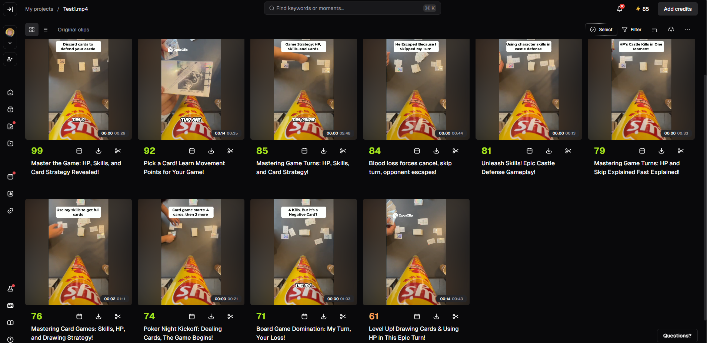

图 7-1：Test1.mp4 的候选结果页，展示自动生成的标题、时长与评分。

#### 7.2.2 评分与自动标题

体验中观察到，产品从 Hook、Flow、Value、Trend 四个维度提供评价。本次将其作为筛选片段的提示，关注以下问题：

| 评价维度 | 体验时关注的问题 |
| --- | --- |
| Hook | 开头是否吸引注意，能否让观众愿意继续观看？ |
| Flow | 内容是否连贯，前后衔接是否自然？ |
| Value | 片段是否提供信息、观点或娱乐价值？ |
| Trend | 内容是否可能符合受众兴趣或传播趋势？ |

以上是本次体验对评价维度的理解，不涉及平台内部算法。四维评价来自人工操作反馈，图 7-1 主要展示总评分和标题。

系统还为候选自动生成标题，围绕视频中的游戏规则、卡牌和角色技能组织内容。体验者认为标题较有吸引力，能够帮助快速理解片段主题。

评分和标题可以辅助筛选，但标题是否准确、高分是否对应真实传播效果，仍需进一步检查。本次未发布视频或采集观看数据，因此不将平台评分作为实际传播效果的结论。

#### 7.2.3 人工编辑与字幕修改

编辑器同时展示转写文本、视频预览和时间轴。左侧查看文本，中间预览画面，下方查看视频缩略图及音频波形，方便结合内容和时间位置进行编辑。

本次截图中的候选采用 9:16 竖屏画幅，界面显示时长约为 26 秒。

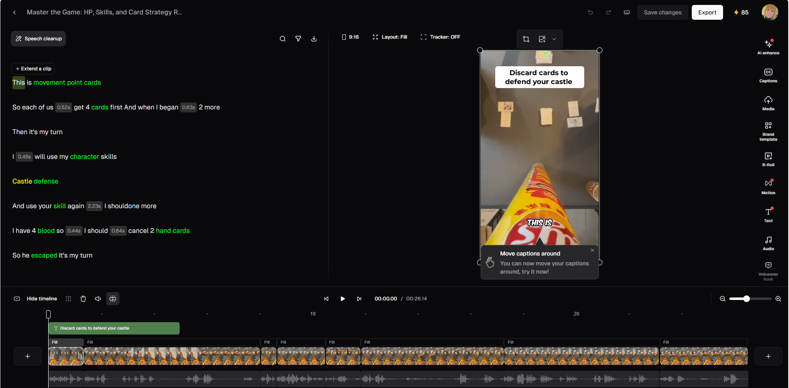

图 7-2：编辑器同时展示转写文本、视频预览、时间轴和音频波形。

本次实际修改了自动识别的字幕，并在预览中观察到修改后的文字。保存并重新进入编辑器后，体验者确认修改结果得到保留。

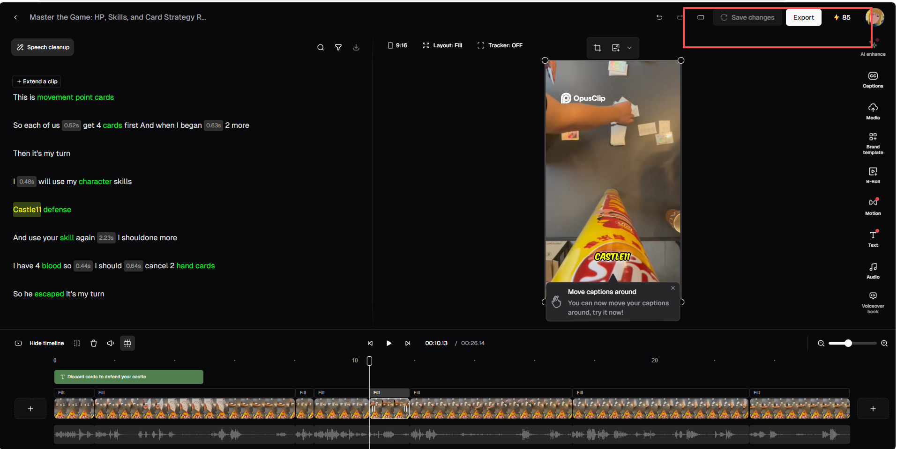

图 7-3：修改后的字幕出现在转写文本和预览中；保存恢复结果依据人工检查记录。

体验中还发现音量调整、分段、变速、添加效果及 AI 辅助剪辑等功能。视频画面与音频波形分层呈现，便于观察和调整，但本次未逐项测试所有功能的最终输出，也不依据界面分层推断内部数据模型。

#### 7.2.4 AI 语音清理

本次实际使用了消除语气词等 AI 辅助功能，体验了在自动生成候选后继续清理口语内容的操作流程。

这类功能为精简片段提供了入口，但本次未统计识别准确率、误删比例或节省的编辑时间，也未对处理前后的自然程度开展系统评价。

本项依据体验者操作反馈；图 7-2 和图 7-3 可见 Speech cleanup 入口。

#### 7.2.5 保存、处理反馈与导出

本次完成了以下验证：

| 检查项目 | 本次结果与依据 |
| --- | --- |
| 字幕修改 | 已操作，修改后的文字出现在预览中。 |
| 保存恢复 | 保存并重新进入后，体验者确认修改保留。 |
| 编辑状态提示 | 对应候选显示 Edited 标记。 |
| 处理反馈 | 处理期间显示预计剩余时间。 |
| MP4 下载 | 浏览器下载面板显示对应文件下载完成。 |

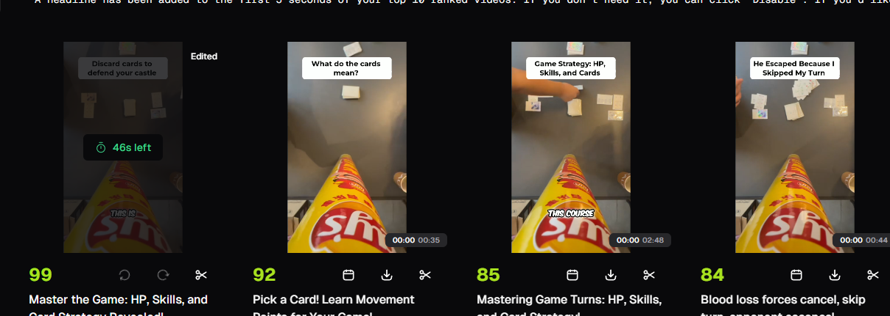

图 7-4：候选卡片显示 Edited 标记及预计剩余时间。“46s left”是当时的预估值，不是完整处理耗时。

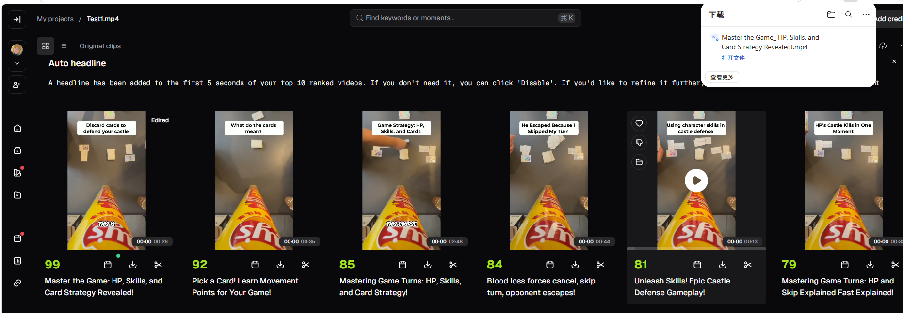

图 7-5：浏览器下载面板显示导出的 MP4 文件已下载完成。

已编辑标记有助于区分修改过的候选，处理提示帮助用户理解后台任务状态，下载入口则连接编辑结果与最终成品。

本次未记录最终文件的编码参数、分辨率及精确时长，也未测量逐帧切点和音画同步误差。

### 7.3 Descript 实际体验

#### 7.3.1 素材导入与编辑器布局

本次使用 Descript 网页版，将 `Test1.mp4` 导入项目 `Test1`。界面展示上传完成提示及转写文本，项目总时长显示约为 5 分 45 秒。

编辑器左侧展示转写文本，中间为视频预览，下方提供视频时间轴及音频波形，右侧为 Underlord AI 对话面板和工具入口。

体验者认为其基础剪辑功能与本次使用的 OpusClip 有较多相似之处，最明显的差别是能够直接通过对话向 AI 提出编辑要求。

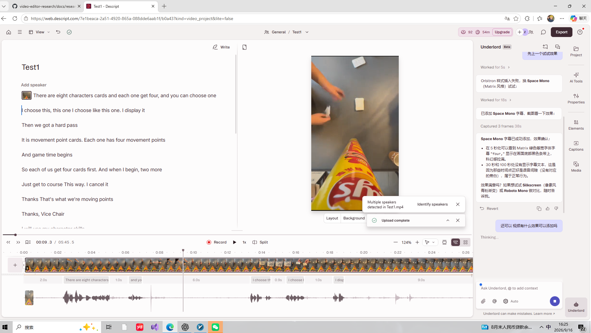

图 7-6：Descript 同时展示转写文本、视频预览、时间轴、音频波形及 Underlord 对话面板。

本次尚未单独记录“删除转写文字后，对应音视频同步删除并可撤销”的验证结果，因此不将该流程列为已完成测试。

#### 7.3.2 对话式字幕调整

本次向 Underlord 输入“添加字幕，做的科幻一点”。AI 推荐了 Orbitron、Space Mono、Silkscreen 和 Roboto Mono 等样式，并描述各自的视觉特点。

随后输入“先上一个试试效果”。对话中，AI 报告 Orbitron 样式插入失败，转而尝试 Space Mono，并反馈已添加字幕。

这一过程体现出三个交互特点：

1. 用户可以先描述希望达到的效果，再由 AI 提供具体选项。
2. 执行过程通过对话反馈，用户能够看到失败信息和替代尝试。
3. 用户可以继续提出要求，逐步调整编辑结果。

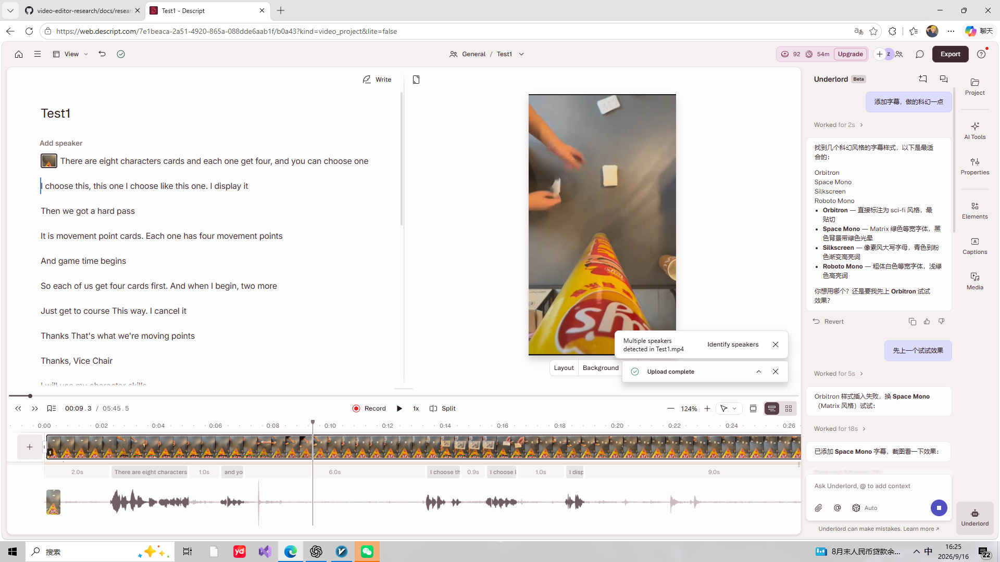

图 7-7：用户提出字幕风格要求，Underlord 推荐样式，并在报告插入失败后尝试替代方案。

当前截图能够证明上述对话过程，但 AI 报告“已添加”不等同于字幕效果已全面验证。字幕是否在各个位置正确显示，仍需播放检查。

#### 7.3.3 对话式画面效果调整

本次继续输入“随便一个，来点氛围感”，让 AI 提出并执行画面调整。

对话中，AI 说明其尝试添加双色调、暗角和颗粒等效果，并继续调整。截图中的视频预览与时间轴缩略图出现了明显的蓝紫、暖黄色调及颗粒变化。

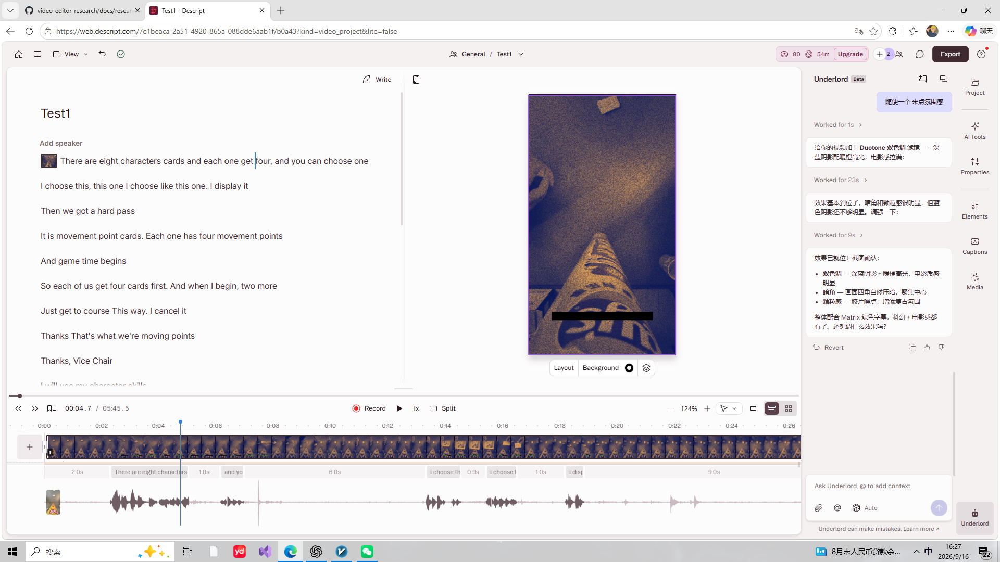

图 7-8：通过自然语言提出要求后，视频预览和时间轴缩略图出现明显的色调与颗粒变化。

这一结果说明，本次对话能够推动项目中的实际画面修改，而不只是提供操作建议。

不过，“氛围感”属于主观要求。当前画面颗粒较明显，是否符合预期、是否影响主体和字幕辨识，仍需人工判断，不能仅凭 AI 的完成说明认定视觉质量达标。

#### 7.3.4 导出设置与可见限制

本次打开 Export 面板，观察到以下设置：

| 项目 | 本次截图中的状态 |
| --- | --- |
| 当前类别 | Video |
| 其他类别入口 | Audio、Timeline、Transcript、Subtitles，尚未逐项验证 |
| 当前目标 | Descript（web link） |
| 分辨率 | Max（720p） |
| 链接访问范围 | Anyone with the link |
| 水印 | 预览显示 Descript 水印，面板提示升级以移除 |
| 视频信息 | 显示约 5:45、约 518 MB |
| 主要操作按钮 | Publish |

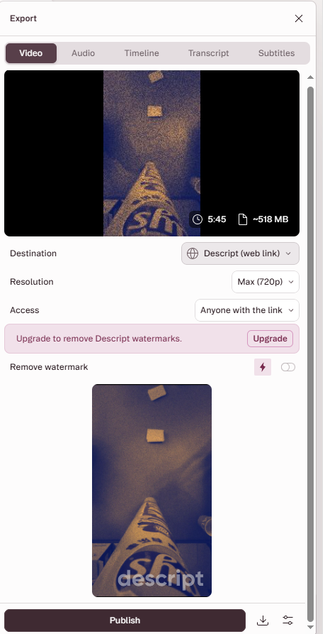

图 7-9：导出面板展示网页链接目标、最高 720p 设置、访问范围及去水印升级提示。

上述信息反映当前账号及当前配置，不代表所有套餐和导出方式都具有相同限制。约 518 MB 是导出前的界面显示，不是最终文件大小的实测结果。

当前选择的是网页链接发布，尚未确认发布完成、本地下载或成品播放，因此本次只记录导出设置检查，不将最终输出成功列为已验证结论。

### 7.4 两个产品的体验对比

| 对比维度 | OpusClip 本次体验 | Descript 本次体验 |
| --- | --- | --- |
| 主要路径 | 自动生成候选，再筛选和编辑 | 导入素材后，结合文本、时间轴和 AI 对话编辑 |
| 候选辅助信息 | 查看自动标题、总评分及四维评价 | 本次未重点测试候选生成与评分 |
| AI 操作方式 | 通过功能入口使用语气词清理等能力 | 通过 Underlord 输入自然语言要求并继续对话 |
| 字幕操作 | 修改文字，并验证保存恢复 | 提出样式要求，观察推荐与执行反馈 |
| 画面效果 | 发现相关编辑功能 | 通过对话触发调整，预览出现变化 |
| 输出验证 | 已完成 MP4 下载 | 已查看导出设置，最终发布或下载尚未确认 |

本次 OpusClip 体验更集中于“生成候选—筛选—修改—导出”；Descript 体验更突出“表达意图—AI 执行—查看结果—继续调整”。

这一比较针对实际操作路径，不代表产品完整能力范围。尤其不能将“本次未在 OpusClip 中体验到对话式编辑”写成该产品完全不支持相关功能。

### 7.5 对 ClipForge 的设计启发

| 观察到的设计 | 对 ClipForge 的启发 |
| --- | --- |
| 候选卡片展示标题、时长与评分 | 集中呈现候选信息，方便逐项预览和筛选。 |
| 多维度评价与选择理由 | 帮助用户理解自动选片依据，保留人工调整和否决能力。 |
| 文本、预览和时间轴共同展示 | 建立字幕、片段范围与画面的对应关系，降低检查成本。 |
| 字幕修改与保存恢复 | 保留用户确认后的编辑结果，避免重复操作。 |
| 已编辑标记与处理提示 | 明确区分原始结果、人工修改、处理中状态和可获取成品。 |
| 对话式 AI 编辑 | 允许用户以自然语言提出要求，再转化为具体操作。 |
| AI 执行反馈与替代尝试 | 清楚说明成功、失败和替代方案，并支持结果检查与撤销。 |
| 导出条件集中展示 | 在输出前说明目标、分辨率、水印和访问范围。 |

现阶段 ClipForge 应优先完成视频导入、后台处理、候选生成、人工复核、字幕修改、项目保存和导出的主流程。

自动标题、语气词清理、对话式编辑及更多视觉效果可作为扩展方向，根据开发周期安排。对于 AI 生成或修改的结果，应提供预览及恢复方式，保留用户对最终剪辑的控制。

### 7.6 体验结论与局限

本次已完成两个产品的不同侧重点体验：

- **OpusClip：** 完成视频上传、候选查看、人工编辑、保存恢复和 MP4 下载，并实际使用语气词清理。体验者认为整体较好用，自动标题有吸引力。
- **Descript：** 完成素材导入、编辑界面体验、对话式字幕与画面效果调整，以及导出设置检查。体验者感受到其对话式 AI 参与程度更高。

对 ClipForge 的共同启发是：系统可以先提出候选或执行编辑建议，但结果应允许用户检查、修改、保存和恢复。

本次仍存在以下限制：

1. 仅使用一个素材，不能代表不同语言、内容类型和视频长度下的表现。
2. 未量化评估转写准确率、候选质量、语气词清理效果、AI 指令成功率及处理性能。
3. 未验证候选评分与真实观看量、完播率或传播效果的关系。
4. 未逐项测试所有编辑功能，也未系统核对全部套餐和额度规则。
5. Descript 的文本删除与音视频联动、最终发布或下载仍待验证。
6. 未进行逐帧切点、音画同步误差及导出画质的系统测量。

上述局限不影响记录本次交互体验，但应避免将功能入口、AI 自述或单个样本结果写成全面验证结论。

### 7.7 证据与参考资料

#### 实际体验证据

| 图号 | 文件名 | 主要证明内容 |
| --- | --- | --- |
| 图 7-1 | `opusclip-results.png` | 候选短片、自动标题、时长及总评分 |
| 图 7-2 | `opusclip-editor.png` | 转写文本、预览、时间轴和音频波形 |
| 图 7-3 | `opusclip-caption-edit.png` | 字幕修改及预览中的文字变化 |
| 图 7-4 | `opusclip-processing.png` | Edited 标记及预计剩余处理时间 |
| 图 7-5 | `opusclip-download.png` | MP4 下载完成 |
| 图 7-6 | `descript-editor-ai-feedback.png` | 编辑器布局及 AI 执行反馈 |
| 图 7-7 | `descript-ai-caption-request.png` | 字幕风格要求、推荐与替代尝试 |
| 图 7-8 | `descript-ai-visual-effects.png` | 对话要求与可见的画面效果变化 |
| 图 7-9 | `descript-export-options.png` | 导出设置、水印与当前可见限制 |

补充人工记录包括：OpusClip 四维评价、字幕保存恢复及语气词清理体验，以及两个产品的主观使用感受。截图未直接展示的操作结果，均以人工反馈为依据。

#### 官方参考资料

- [OpusClip 官方产品与流程介绍](https://help.opus.pro/docs/article/introduction-to-opusclip)
- [Descript 官方产品介绍](https://www.descript.com/)

官方资料用于补充产品背景，不能替代本次操作与截图证据。本节实测结论以实际体验范围为准。
## 8. 调研结论与后续工作

### 8.1 当前验证结果

本次已完成三个参考项目的基础流程实验：

| 项目 | 已验证内容 | 当前调查边界 |
| --- | --- | --- |
| Shotcut / MLT | 素材导入、剪辑、保存并重新打开 MLT 工程、MP4 导出及人工播放 | 已补充工程读写、分割、播放控制、滤镜挂接及后台导出模块关系；尚未完成源码编译和底层算法调查 |
| AutoClip | 本地部署、自动转写、模型分析、切片生成、预览、下载及本地播放 | 已初步调查任务编排、LLM 调用和数据模型；实际任务启动路径、完整模块关系及质量评估仍需补充 |
| OpenCut Classic | 本地部署、视频导入、分割与删除片段、MP4 导出、本地播放及刷新恢复 | 已调查主要模块、时间轴、浏览器存储及预览导出流程；尚未深入调查 Rust/WASM 内部实现及性能 |

OpenCut Classic 本次导出使用 MP4（H.264）、Low 质量并勾选包含音频，成品约 4 分 18 秒，人工检查可以正常播放。刷新编辑器后，项目、素材和剪辑结果保留正常。

以上结果说明三个项目的基础流程已在本次环境和样本中跑通，不代表已完成全部功能、性能或稳定性验证。

依据见第 3.1、4.1、4.5、5.1 节。

### 8.2 三个项目对 ClipForge 的参考价值

| 项目 | 当前最有价值的参考内容 |
| --- | --- |
| OpenCut Classic | 网页端时间轴的数据组织、编辑命令、自动保存，以及预览与导出之间的关系 |
| AutoClip | 将素材导入、字幕准备、模型分析和切片生成组织为后台处理流程 |
| Shotcut / MLT | 使用工程文件记录素材引用、片段范围与排列顺序，并恢复人工编辑结果 |

三个项目分别提供了交互编辑、自动处理和工程交换方面的参考。本次尚未完成它们之间的数据转换或系统集成，因此当前结论是设计参考，而非已验证的集成方案。

依据见第 3.2—3.4、4.2—4.5、5.2—5.3 节。

### 8.3 对 ClipForge 的初步设计启发

#### 统一剪辑数据，区分不同时间含义

OpenCut Classic 将素材引用、时间轴位置、片段时长和素材裁剪范围分别记录；Shotcut 的 MLT 工程通过素材引用与片段范围保存编辑安排；AutoClip 的切片数据包含起止时间、标题和输出路径。

ClipForge 可以据此设计统一的剪辑清单，明确区分素材中的取用范围和成品中的排列位置，并统一时间单位。后续由不同模块读取该清单，生成预览、视频或 MLT 工程。

这属于拟议设计，转换正确性仍需通过样例和测试验证。

依据见第 3.4.1、4.5、5.2 节。

#### 将模型建议与用户确认后的剪辑安排分开

AutoClip 提供自动生成候选片段的参考，OpenCut Classic 提供人工调整时间轴的参考。

ClipForge 可以先保留模型给出的时间范围、评分与理由，再由用户复核和调整，最后形成确认后的剪辑清单。模型评分不应直接替代人工质量评价。

依据见第 3.1、3.4.1、4.1、4.3 节。

#### 分别记录项目、任务和输出结果

AutoClip 将项目、后台任务和切片分别建模；OpenCut Classic 区分项目、素材与时间轴片段。

ClipForge 可以参考这种分工，分别记录素材与编辑状态、任务进度与失败原因、最终输出文件，明确区分上传成功、任务提交成功和处理完成。

依据见第 3.2、3.4.1、4.2、4.5 节。

#### 让预览与导出遵循一致的剪辑语义

OpenCut Classic 的预览和导出共用部分场景构建与渲染代码，但更新方式及部分处理分支不同。

ClipForge 应让预览和导出对片段位置、裁剪范围及变速使用一致的定义，并通过测试比较结果，不能仅因共用数据结构就认定两者完全一致。

依据见第 3.4.2 节。

#### 明确项目保存的位置与恢复范围

OpenCut Classic 所查项目保存流程使用 IndexedDB 和 OPFS。它为浏览器内的项目恢复提供了参考，但本次仅验证了当前浏览器刷新后的恢复。

ClipForge 需要单独设计服务端项目持久化、素材路径管理及备份机制，避免把浏览器本地保存等同于跨设备可恢复。

依据见第 3.1、3.2 节。

### 8.4 当前限制

- 基础实验覆盖的素材数量有限，尚未系统测量处理速度、资源占用、字幕准确率、切点质量及音画同步误差。
- 三个项目的主要模块图已补充源码依据，但未穷举全部模块和异常分支；静态调用关系不替代运行验证。
- Shotcut 安装版本与所查源码提交是否对应同一发布版本，尚未确认；也未完成源码编译。
- AutoClip 实际任务启动路径仍待运行证据核对；已记录的问题不能因基础流程成功而视为已修复。
- OpenCut Classic 本地修正了数据库配置路径并调整运行方式，尚未完成生产部署、跨浏览器恢复及长视频性能测试。
- 各项目的依赖、模型、素材及外部服务条款尚未逐项核对。
- 两款商业产品的体验记录已整理。Descript 的文本删改联动、最终发布或下载尚未确认；两款产品均未完成系统性的质量与性能测量，详见第 7.6 节。
- ClipForge 的跨组件集成、EDL 转换和产品功能尚未实现验证；需求文档与设计图不替代运行证据。

各项限制的实验或源码背景见第 3—7 节。

### 8.5 第一周配套交付状态

| 交付项 | 当前状态与入口 | 仍需处理 |
| --- | --- | --- |
| 调研报告 v1 | 本报告已包含三个项目的基础实验、源码调查、六维对比和两款产品体验 | 已补充三个主要模块图及源码依据；继续核对证据并排版，确认最终达到 8 页 |
| 需求规格说明书 | [requirements.md](requirements.md)：8 条功能需求、5 条非功能需求，每条含验收判据，并有借鉴说明 | 后续按实现进度维护需求状态，不将设计目标记为实测结果 |
| 用例图与主流程时序图 | [design-diagrams.md](design-diagrams.md)：两张图及需求对应说明 | 后续开发变更时同步调整 |
| 仓库与 CI | 根目录 README、`.gitignore`、[lint＋test 占位配置](../.github/workflows/ci.yml) 已建立 | 应用开发阶段接入真实检查和测试 |
| MLT 工程样本 | [Week1Work.mlt](samples/Week1Work.mlt) 及[样本说明](samples/README.md)已归档 | 已据录制者本人确认补充素材来源及本项目使用说明；跨机器打开尚未验证 |

2026-09-17 核对仓库提交 `39861a61879dfa5c901ec3c790e4bb9e3ed00432` 时，[对应 CI 运行成功](https://github.com/TiAmoLovee/video-editor-research/actions/runs/35171077991)。该工作流仅输出 lint、test 占位提示，不能据此认定代码规范或功能测试通过。

### 8.6 后续工作

1. 检查本轮补充的模块图在 GitHub 的显示，按最终报告版式调整大小；主要源码关系已在第 3.3、4.4、5.3 节列出。
2. 核对 AutoClip 实际任务执行路径，以及空结果仍返回成功、同步异常仅记日志的分支；未复现前保留静态源码发现的表述。
3. 检查已补充的工程样本来源说明、引用、图片和版本记录，排版导出并确认页数。
4. 需要进一步评价商业产品时，补做 Descript 文本删改联动与最终输出验证；当前未验证部分保留在体验边界中。
5. 在后续开发中按需求规格的分阶段安排，先打通上传、异步任务、统一剪辑清单和输出，再逐步加入语音转写、评分与人工复核。
6. 后续评测记录字幕质量、候选质量、切点、音画同步、耗时及资源占用；不将尚未开展的测量写为达标。

当前已形成第一周主要文档和基础实验记录，剩余收尾集中在图表显示检查、来源核对与报告排版。三个参考项目的模块图与 ClipForge 自身的用例图、主流程时序图用途不同，需要分别保留。

## 9. 参考资料

以下资料用于支持正文中的实验和源码分析。源码链接尽量固定到本次记录的提交，避免后续版本变化影响复核。各项结论的具体依据仍保留在对应正文中。

### 9.1 AutoClip

本次记录的提交：`aaf863bbd7bba99c64bc53284d41c0ed19034387`。

| 资料 | 对应调查内容 |
| --- | --- |
| [固定版本源码目录](https://github.com/zhouxiaoka/autoclip/tree/aaf863bbd7bba99c64bc53284d41c0ed19034387) | 本次源码调查的版本依据 |
| [Docker Compose 配置](https://github.com/zhouxiaoka/autoclip/blob/aaf863bbd7bba99c64bc53284d41c0ed19034387/docker-compose.yml) | 服务编排、共享目录和健康检查 |
| [项目 API](https://github.com/zhouxiaoka/autoclip/blob/aaf863bbd7bba99c64bc53284d41c0ed19034387/backend/api/v1/projects.py) | 文件上传、项目创建和任务启动 |
| [项目卡片组件](https://github.com/zhouxiaoka/autoclip/blob/aaf863bbd7bba99c64bc53284d41c0ed19034387/frontend/src/components/ProjectCard.tsx) | 等待状态项目的自动启动逻辑 |
| [视频处理任务](https://github.com/zhouxiaoka/autoclip/blob/aaf863bbd7bba99c64bc53284d41c0ed19034387/backend/tasks/processing.py) | 后台任务执行及状态更新 |
| [处理适配器](https://github.com/zhouxiaoka/autoclip/blob/aaf863bbd7bba99c64bc53284d41c0ed19034387/backend/services/simple_pipeline_adapter.py) | 字幕准备及处理步骤组织 |
| [处理步骤目录](https://github.com/zhouxiaoka/autoclip/tree/aaf863bbd7bba99c64bc53284d41c0ed19034387/backend/pipeline) | 大纲、时间定位、评分、标题、聚类及视频生成 |
| [LLM 管理器](https://github.com/zhouxiaoka/autoclip/blob/aaf863bbd7bba99c64bc53284d41c0ed19034387/backend/core/llm_manager.py) | 模型配置、提供商选择和调用重试 |
| [模型提供商实现](https://github.com/zhouxiaoka/autoclip/blob/aaf863bbd7bba99c64bc53284d41c0ed19034387/backend/core/llm_providers.py) | DashScope 请求、响应和日志处理 |
| [数据库模型目录](https://github.com/zhouxiaoka/autoclip/tree/aaf863bbd7bba99c64bc53284d41c0ed19034387/backend/models) | 项目、任务及切片的数据定义 |
| [项目许可证](https://github.com/zhouxiaoka/autoclip/blob/aaf863bbd7bba99c64bc53284d41c0ed19034387/LICENSE) | 项目自身的许可证核对 |

### 9.2 Shotcut / MLT

本次记录的 Shotcut 源码提交：`8cd39efcdf8ab80390ee4736db2f52577fc82cdc`。

| 资料 | 对应调查内容 |
| --- | --- |
| [Shotcut 主窗口源码](https://github.com/mltframework/shotcut/blob/8cd39efcdf8ab80390ee4736db2f52577fc82cdc/src/mainwindow.cpp) | 保存操作入口及保存对象选择 |
| [Shotcut 控制器源码](https://github.com/mltframework/shotcut/blob/8cd39efcdf8ab80390ee4736db2f52577fc82cdc/src/mltcontroller.cpp) | 工程读取、XML 生成和文件写入 |
| [时间轴面板](https://github.com/mltframework/shotcut/blob/8cd39efcdf8ab80390ee4736db2f52577fc82cdc/src/docks/timelinedock.h) | 获取时间轴数据模型 |
| [多轨数据模型](https://github.com/mltframework/shotcut/blob/8cd39efcdf8ab80390ee4736db2f52577fc82cdc/src/models/multitrackmodel.h) | 获取 MLT 多轨对象 |
| [MLT XML 官方文档](https://www.mltframework.org/docs/mltxml/) | 工程 XML 的结构和素材引用 |
| [MLT MVCP 文档](https://www.mltframework.org/docs/mvcp/) | 起止点及包含结束帧的语义参考 |
| [Shotcut FAQ](https://shotcut.org/FAQ/) | 软件使用及许可证信息 |
| [MLT 版权政策](https://www.mltframework.org/docs/copyrightpolicy/) | 框架核心、模块及程序的许可证区分 |

版本说明：本地实验使用 Shotcut 26.8.1；尚未确认上述源码提交与该安装版本对应同一发布版本。

### 9.3 OpenCut Classic

本次记录的源码提交：`cf5e79e919144200294fb9fed22a222592a0aeea`。

| 资料 | 对应调查内容 |
| --- | --- |
| [固定版本源码目录](https://github.com/OpenCut-app/opencut-classic/tree/cf5e79e919144200294fb9fed22a222592a0aeea) | 本次调查的版本依据 |
| [项目 README](https://github.com/OpenCut-app/opencut-classic/blob/cf5e79e919144200294fb9fed22a222592a0aeea/README.md) | 项目定位、目录和启动说明 |
| [依赖与脚本配置](https://github.com/OpenCut-app/opencut-classic/blob/cf5e79e919144200294fb9fed22a222592a0aeea/package.json) | Bun 版本声明及项目脚本 |
| [Docker Compose](https://github.com/OpenCut-app/opencut-classic/blob/cf5e79e919144200294fb9fed22a222592a0aeea/docker-compose.yml) | 数据库、Redis 和相关服务编排 |
| [数据库初始化配置](https://github.com/OpenCut-app/opencut-classic/blob/cf5e79e919144200294fb9fed22a222592a0aeea/apps/web/drizzle.config.ts) | 本地部署中发现的 schema 路径问题 |
| [编辑器核心](https://github.com/OpenCut-app/opencut-classic/blob/cf5e79e919144200294fb9fed22a222592a0aeea/apps/web/src/core/index.ts) | 管理器创建与功能组织 |
| [界面与核心连接](https://github.com/OpenCut-app/opencut-classic/blob/cf5e79e919144200294fb9fed22a222592a0aeea/apps/web/src/editor/use-editor.ts) | 获取编辑器核心及订阅状态变化 |
| [管理器目录](https://github.com/OpenCut-app/opencut-classic/tree/cf5e79e919144200294fb9fed22a222592a0aeea/apps/web/src/core/managers) | 项目、素材、命令、保存及渲染管理 |
| [项目数据类型](https://github.com/OpenCut-app/opencut-classic/blob/cf5e79e919144200294fb9fed22a222592a0aeea/apps/web/src/project/types.ts) | 项目、场景引用与画布设置 |
| [时间轴数据类型](https://github.com/OpenCut-app/opencut-classic/blob/cf5e79e919144200294fb9fed22a222592a0aeea/apps/web/src/timeline/types.ts) | 场景、轨道、片段及时间字段 |
| [分割命令](https://github.com/OpenCut-app/opencut-classic/blob/cf5e79e919144200294fb9fed22a222592a0aeea/apps/web/src/commands/timeline/element/split-elements.ts) | 分割位置、素材裁剪范围和撤销 |
| [删除命令](https://github.com/OpenCut-app/opencut-classic/blob/cf5e79e919144200294fb9fed22a222592a0aeea/apps/web/src/commands/timeline/element/delete-elements.ts) | 从轨道移除片段及恢复操作 |
| [内部时间表示](https://github.com/OpenCut-app/opencut-classic/blob/cf5e79e919144200294fb9fed22a222592a0aeea/apps/web/src/wasm/media-time.ts) | 整数 tick 与秒之间的转换 |
| [本地存储服务](https://github.com/OpenCut-app/opencut-classic/blob/cf5e79e919144200294fb9fed22a222592a0aeea/apps/web/src/services/storage/service.ts) | IndexedDB 与 OPFS 的存储分工 |
| [服务端数据表](https://github.com/OpenCut-app/opencut-classic/blob/cf5e79e919144200294fb9fed22a222592a0aeea/apps/web/src/db/schema.ts) | 用户、会话、账号、验证和反馈数据定义 |
| [预览组件](https://github.com/OpenCut-app/opencut-classic/blob/cf5e79e919144200294fb9fed22a222592a0aeea/apps/web/src/preview/components/index.tsx) | 预览场景构建与画面更新 |
| [场景构建](https://github.com/OpenCut-app/opencut-classic/blob/cf5e79e919144200294fb9fed22a222592a0aeea/apps/web/src/services/renderer/scene-builder.ts) | 将时间轴与素材转换为渲染场景 |
| [画面渲染器](https://github.com/OpenCut-app/opencut-classic/blob/cf5e79e919144200294fb9fed22a222592a0aeea/apps/web/src/services/renderer/canvas-renderer.ts) | 节点解析、帧描述、纹理同步与合成调用 |
| [视频导出器](https://github.com/OpenCut-app/opencut-classic/blob/cf5e79e919144200294fb9fed22a222592a0aeea/apps/web/src/services/renderer/scene-exporter.ts) | 逐帧导出、音视频编码配置及文件封装 |
| [音频处理](https://github.com/OpenCut-app/opencut-classic/blob/cf5e79e919144200294fb9fed22a222592a0aeea/apps/web/src/media/audio.ts) | 时间轴音频缓冲区准备 |
| [导出界面](https://github.com/OpenCut-app/opencut-classic/blob/cf5e79e919144200294fb9fed22a222592a0aeea/apps/web/src/components/editor/export-button.tsx) | 导出参数提交及成品下载 |
| [项目许可证](https://github.com/OpenCut-app/opencut-classic/blob/cf5e79e919144200294fb9fed22a222592a0aeea/LICENSE) | 项目自身的 MIT 许可证 |

版本说明：以上链接指向原始提交。本地部署修改了数据库 schema 路径、Redis 宿主机端口及网页环境配置，具体处理见第 3.1 节；这些本地调整不包含在上述原始源码链接中。

Descript / Opus Clip 产品体验部分的参考资料将在实际体验后补充。
### 9.4 实验材料

| 材料 | 用途及归档说明 |
| --- | --- |
| [Shotcut 工程样本 Week1Work.mlt](samples/Week1Work.mlt) | 用于检查素材引用、片段范围和轨道排列 |
| Shotcut MP4 导出与人工播放记录 | 见第 5.1 节 |
| [AutoClip 切片结果截图](autoclip-result.png) | 展示切片标题、评分及时间范围，实验说明见第 4.1 节 |
| AutoClip 部署与处理记录 | 部署、模型调用和切片播放验证见第 4.1、4.5 节；原视频及下载切片保留在本地，未上传仓库 |
| OpenCut Classic 基础实验记录 | 项目 OpenCut-Test1 的导入、分割、删除、导出及刷新恢复结果见第 3.1 节 |
| OpenCut Classic 导出成品 | MP4（H.264），Low 质量，勾选包含音频；播放器显示约 4 分 18 秒，已人工确认可以正常播放 |
| OpenCut Classic 页面截图 | 用于记录编辑器状态及导出设置，已归档至 docs，见第 3.1 节 |

本报告引用的 AutoClip、OpenCut Classic、OpusClip 和 Descript 图片均已在仓库归档；终端输出和原始视频未全部上传，AutoClip 原视频与下载切片按实验记录保留本地。页面截图、人工播放记录与源码调查提供不同类型的证据，不能互相替代。

OpenCut Classic 的刷新恢复检查仅验证了当前浏览器中的项目恢复，未验证跨浏览器或跨设备恢复。
